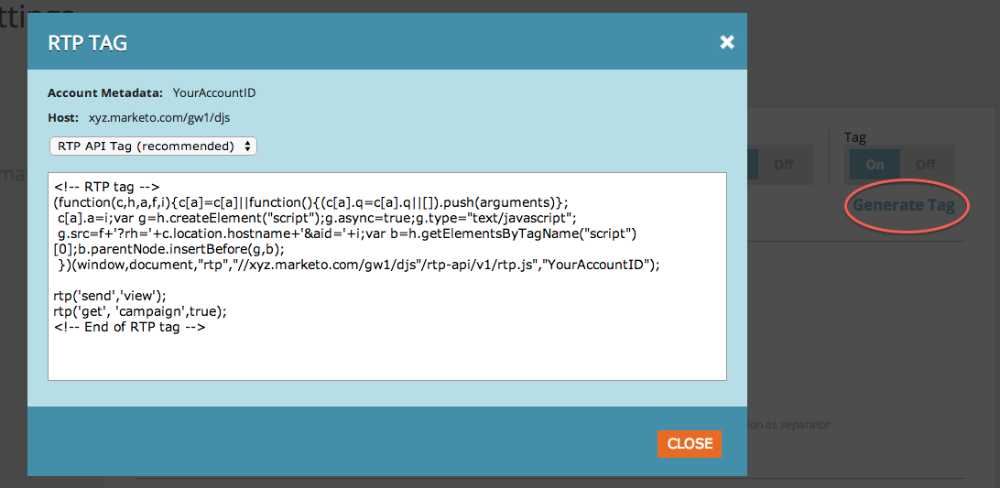

# Implementera RTP med Google Tag Manager {#implementing-rtp-using-google-tag-manager}

Följ installationsanvisningarna nedan för att implementera RTP-taggen.

1. Logga in på ditt Google Tag Manager-konto.

1. Lägg till en ny tagg > Taggkonfigurationer > Egen HTML-tagg**.** Ring **RTP**.

1. Logga in på ditt RTP-konto**.**

1. Gå till **Kontoinställningar**.

   a. Om du redan har fått din JavaScript-tagg från Support fortsätter du till steg 6.

   

1. Under Domän letar du reda på den relevanta domänen och klickar på **Generera tagg**.

   

1. Kopiera RTP JavaScript-taggen och klistra in den i den nya **Egen HTML-tagg** du skapade (steg 1).

1. Klicka **+Lägg till regel i Fire-tagg**. Välj **Alla sidor**.

1. Klicka **Spara** och [publicera den nya versionen](https://support.google.com/tagmanager/answer/2699097?hl=en).

1. Kontrollera att den visas på alla sidor, inklusive landningssidor och underdomäner.

   a. Du kan göra detta genom att högerklicka på webbplatsens sida. Gå till **Inspect Element**, Sök efter **RTP** för att hitta taggen.
