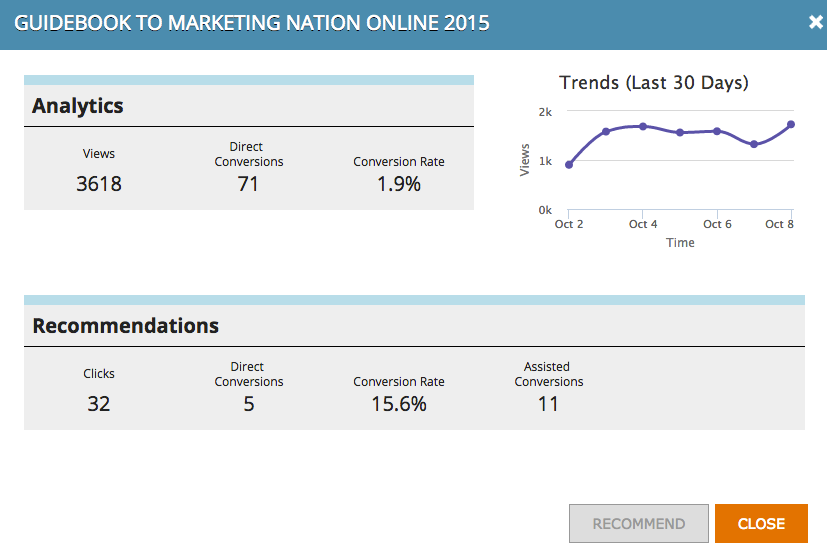

# Innehållsanalys {#understanding-content-analytics}

På sidan Innehållsanalys visas det innehåll du har upptäckt (fallstudier, blogginlägg, videor, pressmeddelanden och så vidare) från webbplatsen. Det visar också prestanda för ert innehåll och personer som genereras när besökarna interagerar med dem.

## Visa innehållsanalys {#view-content-analytics}

Gå till **Innehållsanalys**.

På sidan Innehållsanalys kan du:

* Filtrera efter tidsintervall (dag, vecka och månad)
* Sök efter innehållstitel och innehålls-URL
* Sortera i fallande eller stigande ordning genom att klicka på kolumnrubriken för Vyer, Direktkonvertering och Konverteringsgrad.

Du kan också exportera en fil i CSV-format genom att klicka på ikonen .

Analystabellen innehåller följande information:

<table> 
 <thead> 
  <tr> 
   <th colspan="1" rowspan="1">Namn</th> 
   <th colspan="1" rowspan="1">Beskrivning</th> 
  </tr> 
 </thead> 
 <tbody> 
  <tr> 
   <td colspan="1" rowspan="1"><strong>Titel</strong></td> 
   <td colspan="1" rowspan="1">Namnet på resursen för digitalt innehåll. Klicka på <strong>Titel</strong> för att öppna innehålls-URL:en på en ny flik.</td> 
  </tr> 
  <tr> 
   <td colspan="1">
<strong>Rekommendationsikon  </strong><strong></strong>

<strong></strong>
</td> 
   <td colspan="1">Anger om innehållsdelen har lagts till för <a href="#">Content Recommendations</a>.</td> 
  </tr> 
  <tr> 
   <td colspan="1" rowspan="1">
<strong>Vyer</strong>
</td> 
   <td colspan="1" rowspan="1">
Antalet visningar från webbbesökare på innehållsresursen. Hur många gånger det visats, öppnats, visats eller laddats ned. Klicka på antalet i vykolumnen för att gå ned och se vem som visade innehållet
</td> 
  </tr> 
  <tr> 
   <td colspan="1" rowspan="1"><strong>Direktkonvertering</strong></td> 
   <td colspan="1" rowspan="1">Webbbesökare som tittade på innehållet och fyllde i ett formulär vid samma besök</td> 
  </tr> 
  <tr> 
   <td colspan="1">
<strong>Analysikon</strong>

<strong></strong>
</td> 
   <td colspan="1">Se fler analyser av innehållet</td> 
  </tr> 
  <tr> 
   <td colspan="1">
<strong>Ta bort ikon</strong>

</td> 
   <td colspan="1">Tar bort innehållet från innehållsanalysen</td> 
  </tr> 
 </tbody> 
</table>

## Visa ytterligare innehållsanalys {#view-additional-content-analytics}

Klicka på Analysikonen för en del av innehållet.

En dialogruta öppnas med ytterligare innehållsanalys för den specifika delen av innehållet.

Ytterligare innehållsanalyser är:

**Analyser**

* **Vyer**: Vyer av den delen av innehållet för det valda tidsintervallet
* **Direktkonvertering**: Webbbesökare som tittade på innehållet och fyllde i ett formulär vid samma besök.
* **Konverteringsgrad****:** En konverteringsgrad i procent beräknad av Direct-konverteringar dividerat med Click

**Trender**

* Ett **Trender**-diagram som visar de senaste 30 dagarnas vyer av den specifika delen av innehållet. Håll pekaren över linjediagrammet om du vill visa antalet innehållsvyer från en viss dag

## Ta bort innehåll {#delete-content}

På sidan Innehållsanalys klickar du på ikonen Ta bort för det innehåll du vill ta bort. Ett meddelande visas som bekräftar att du vill ta bort innehållet.

>[!MORELIKETHIS]
>
>* [Aktivera innehållsrekommendationsfältet](../../../product-docs/predictive-content/enabling-predictive-content/enable-the-content-recommendation-bar.md)
>* [Aktivera prediktivt innehåll för multimedia för webben](../../../product-docs/predictive-content/enabling-predictive-content/enable-predictive-content-for-web-rich-media.md)

