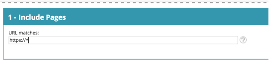

# Ordlista för webbpersonalisering {#web-personalization-glossary}

Några insikter om världen och språket i Marketo Web Personalization.

| Villkor | Definition |
|---|---|
| **Anonym besökare** | En webbbesökare som aldrig fyllt i ett formulär eller lämnat sina uppgifter på webbplatsen. |
| **Webbkampanj** | En anpassad reaktion som är kopplad till ett visst segment. Med webbpersonalisering kan webbkampanjer inkludera dialogrutor, I zoner och widgetar. |
| **Clickstream** | Besökarens aktivitet och URL-sökväg på webbplatsen och hur länge de besökte varje sida |
| **ISP** | Internetleverantör |
| **Känd besökare** | En webbbesökare som har fyllt i ett formulär och lämnat sina uppgifter (e-postadress) på webbplatsen eller klickat på en länk i ett Marketo-e-postmeddelande. |
| **Kontolista** | En lista med nyckelkonton/organisationsnamn. Kallas även kontobaserad marknadsföring (ABM). |
| **Segment** | En samling besökare som uppfyller de angivna villkoren som definieras på sidan &quot;Ställ in ett segment&quot;. |
| **Delad testning** | Ett testexperiment med två eller flera varianter för att mäta skillnaden i resultat. Målet är att identifiera förändringar på webbsidor som ökar eller maximerar ett intressant resultat. |
| **Jokertecken** | Ett jokertecken (*) används före eller efter en sträng för att ersätta andra tecken i en sträng. Se exemplen nedan. |

## Exempel på jokertecken {#wildcard-examples}

Här är tre sätt att använda jokertecken i Webbanpassning.

Matcha alla besökare på sidadresser som slutar med priser (t.ex. [www.marketo.com/pricing):](http://www.marketo.com/pricing):)

Matcha alla besökare på sidadresser som börjar med https:// (till exempel [https://www.marketo.com):](https://www.marketo.com))

Matcha alla besökare på sid-URL:er som innehåller ordet backup (t.ex. [https://www.marketo.com/backup/pricing.html):](https://www.marketo.com/backup/pricing.html):)

