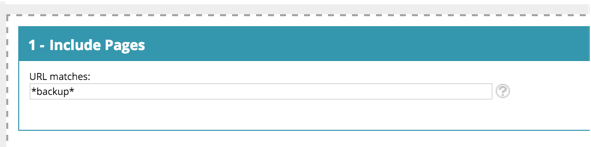

# Personalization-ordlista för webben {#web-personalization-glossary}

Några insikter om Marketo Web Personalization.

| Villkor | Definition |
|---|---|
| **Anonym besökare** | En webbbesökare som aldrig fyllt i ett formulär eller lämnat sina uppgifter på webbplatsen. |
| **Webbkampanj** | En anpassad reaktion som är kopplad till ett visst segment. Med Web Personalization innehåller webbkampanjer Dialogs, In Zones och Widgets. |
| **Clickstream** | Besökarens aktivitet och URL-sökväg på webbplatsen och hur länge de besökt varje sida |
| **ISP** | Internetleverantör |
| **Känd besökare** | En webbbesökare som har fyllt i ett formulär och lämnat sina uppgifter (e-postadress) på webbplatsen eller klickat på en länk i ett Marketo-mejl. |
| **Kontolista** | En lista med nyckelkonton/organisationsnamn. Kallas även Account-Based Marketing (ABM). |
| **Segment** | En samling besökare som uppfyller de angivna villkoren som definieras på sidan [&quot;Ange ett segment&quot; ](/help/marketo/product-docs/web-personalization/using-web-segments/web-segments.md). |
| **Delad testning** | Ett testexperiment med två eller flera varianter för att mäta skillnaden i resultat. Målet är att identifiera förändringar på webbsidor som ökar eller maximerar ett intressant resultat. |
| **Jokertecken** | Ett jokertecken (&#42; används) som används före eller efter en sträng för att ersätta andra tecken i en sträng. Se exemplen nedan. |

## Exempel på jokertecken {#wildcard-examples}

Här är tre sätt att använda jokertecken i Web Personalization.

Matcha alla besökare på sidadresser som slutar med priser (till exempel `www.marketo.com/pricing`)

Matcha alla besökare på sidadresser som börjar med https:// (till exempel `https://www.marketo.com`)

Matcha alla besökare på sid-URL:er som innehåller ordet backup (till exempel `https://www.marketo.com/backup/pricing.html`)

