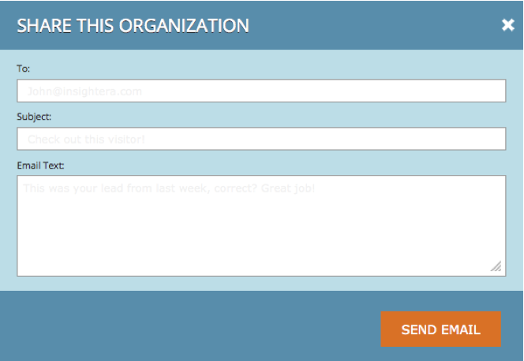

# Personalization - översikt {#web-personalization-overview}

## Introduktion {#introduction}

För nya Marketo-kunder är [!UICONTROL Real-Time Personalization] uppdelat i fyra appar som nås via dessa två paneler: [!UICONTROL Web Personalization] och [!UICONTROL ContentAI].

 

>[!NOTE]
>
>[!UICONTROL Web Personalization] och [!UICONTROL ContentAI] finns på alla språk som stöds av Marketo (engelska, franska, tyska, japanska, portugisiska, spanska).

Befintliga kunder har fortsatt åtkomst till apparna via Personalization-plattan i realtid tills de förnyas, och då kommer de att använda inloggningen ovan.

När du klickar på panelen [!UICONTROL Web Personalization] visas sidan Kontrollpanel. Klicka på rutan [!UICONTROL ContentAI] och gå direkt till sidan Innehållsrekommendationer.

De fyra programmen är:

* [!UICONTROL Web Personalization]
* [!UICONTROL Account-Based Web Marketing]
* [!UICONTROL Website Retargeting]
* [!UICONTROL ContentAI]

Platsen **[!UICONTROL Web Personalization]** är din åtkomstpunkt för att skapa anpassade webbkampanjer. Kontobaserad webbmarknadsföring och återmarknadsföring på webben. Du kan lägga till innehåll på Content Analytics-sidan.

**[!UICONTROL Account-Based Web Marketing]** fungerar med Web Personalization och har namngivna konton. Sidan Namngivna konton innehåller grafisk information om befintliga kunder, totala engagemang och organisationstrender samt en lista över konton. Du kan även skapa nya namngivna konton där.

**[!UICONTROL Website Retargeting]** ger dig möjlighet att ommarknadsföra till segmenterade målgrupper. Du kan ange segment, men inte använda namngivna konton i filtret.

**[!UICONTROL ContentAI]** är platsen där innehållsrekommendationer ska ges. Du kan enkelt lägga till innehåll på sidan Innehållsrekommendationer.

>[!NOTE]
>
>Om du vill komma åt [!UICONTROL Account-Based Web Marketing] eller [!UICONTROL Website Retargeting] måste du klicka på plattan [!UICONTROL Web Personalization], även om du inte har appen [!UICONTROL Web Personalization].

## Organisationer {#organizations}

På fliken Organisationer visas all information (namn, plats, aktivitet och tidsstämpel) om organisationer som besökt din webbplats under en viss period. Tabellen kan sorteras och ordnas efter tid, plats, domän och via en fritextsökning.

>[!TIP]
>
>&quot;Most Active&quot; vs.&quot;Latest&quot; - Tabellen är organiserad av identifierade organisationer och sedan av Internetleverantörer (anges med en ISP-ikon). Den kan sorteras enligt följande:
>
>* Mest aktiva: de mest aktiva organisationerna i tabellen, baserat på antalet sidvisningar
>* Senaste: de senaste organisationerna i tabellen (standard)
>* Om du vill ha värdefulla insikter kan du filtrera enligt de mest aktiva

**Organisationer - högerpanel**

Den högra panelen på sidan Organisationer har följande funktioner och insikter:

<table>
 <tbody>
  <tr>
   <td>
<strong>Ikon för kalkylblad</strong>: I den övre högra delen av panelen hämtas organisationstabellen i CSV-format av ikonen, så att den kan användas offline

<strong>[!UICONTROL Set Email Alert]</strong>: Skickar e-post till den inloggade användaren varje gång den valda organisationen besöker webbplatsen

<strong>[!UICONTROL Leads]</strong>: Öppnar lead-tabellen för den valda organisationen

<strong>[!UICONTROL Share]</strong>: Öppnar ett popup-fönster där du kan skicka e-post och dela information om organisationen som besökte webbsidan

<strong>Platsikon</strong>: Visar land och ort för den valda organisationen

<strong>Länkar</strong>: Jigsaw, whis, Linkedin, Google, Twitter öppnar ett nytt fönster med ytterligare information från respektive webbsida som ger ytterligare information om den valda organisationen

<strong>[!UICONTROL Search]</strong>: Visar det nyckelord som används om besökaren kom fram via en sökmotor

<strong>[!UICONTROL Referrers]</strong>: Visar URL-länken för sidan som refererade trafiken till din plats

<strong>[!UICONTROL Visitors]</strong>: Visar antalet besök, antalet sidor som har visats av den valda organisationen och deras e-postadress (om de har fyllt i ett sändningsformulär) samt tid och datum för det senaste besöket

<strong>[!UICONTROL Clickstream]</strong>: Visar en tabell över användaraktivitet och URL-sökväg på webbplatsen och hur länge användaren besökt varje sida
</td>
   <td></td>
  </tr>
 </tbody>
</table>

**Dela organisationer**

Vill du dela informationen om webbplatsbesökaren med en kollega? Klicka på en organisation och sedan på länken Dela på den högra panelen.

Detta aktiverar övertäckningen [!UICONTROL Share this Organization], där du kan skicka ett e-postmeddelande med namn och information om organisationen som besökte webbplatsen.

## Besökare {#visitors}

Besökarsidan visar alla detaljer och onlinebeteenden för varje besökare som kom in på webbplatsen under den angivna tidsperioden. Sidan ger en djupgående inblick i varje enskild besökares aktiviteter och onlinebeteende. Besöksdata i tabellen uppdateras inom 24-48 timmar.

Den högra panelen på sidan [!UICONTROL Visitors] ger följande insikter:

<table>
 <thead>
  <tr>
   <th colspan="1" rowspan="1">Namn</th>
   <th colspan="1" rowspan="1">Beskrivning</th>
  </tr>
 </thead>
 <tbody>
  <tr>
   <td colspan="1" rowspan="1"><strong>Kalkylbladsikon</strong></td>
   <td colspan="1" rowspan="1">Ikonen finns längst upp till höger på panelen och hämtar tabellen Besökare i CSV-format för användning offline</td>
  </tr>
  <tr>
   <td colspan="1" rowspan="1">
<strong>Organisationsnamn</strong>
</td>
   <td colspan="1" rowspan="1"> </td>
  </tr>
  <tr>
   <td colspan="1" rowspan="1"><strong>Ange kampanj</strong></td>
   <td colspan="1" rowspan="1">Gör att du kan konfigurera ett Campaign-CTA som är kopplat till den valda besökaren</td>
  </tr>
  <tr>
   <td colspan="1"><strong>Plats</strong></td>
   <td colspan="1">Visar besökarens land, delstat och ort</td>
  </tr>
  <tr>
   <td colspan="1" rowspan="1"><strong>Clickstream</strong></td>
   <td colspan="1" rowspan="1">Visar en tabell över besökarens aktivitet och URL-sökväg på webbplatsen och hur länge besökaren besökte varje sida</td>
  </tr>
 </tbody>
</table>

## Realtid {#real-time}

På sidan Realtid visas besökare på webbplatsen i realtid och aktiviteten mäts allt eftersom den utförs.

Realtidssidan delas upp i sex informativa tabeller över besöksinformation på plats:

<table>
 <thead>
  <tr>
   <th colspan="1" rowspan="1">Namn</th>
   <th colspan="1" rowspan="1">Beskrivning</th>
  </tr>
 </thead>
 <tbody>
  <tr>
   <td colspan="1" rowspan="1"><strong>[!UICONTROL Visitors]</strong></td>
   <td colspan="1" rowspan="1"> Representerar antalet besökare som för närvarande finns på webbplatsen</td>
  </tr>
  <tr>
   <td colspan="1" rowspan="1">
<strong>[!UICONTROL Clicks per minute]</strong>
</td>
   <td colspan="1" rowspan="1"> Ett live-linjediagram som visar antalet klick på din webbplats per minut</td>
  </tr>
  <tr>
   <td colspan="1" rowspan="1"><strong>[!UICONTROL Top Organizations]</strong></td>
   <td colspan="1" rowspan="1">En kort version av organisationsregistret</td>
  </tr>
  <tr>
   <td colspan="1"><strong>[!UICONTROL Real-Time Segment]</strong></td>
   <td colspan="1">Antalet besökare som för närvarande är på plats och som matchar valda segment</td>
  </tr>
  <tr>
   <td colspan="1"><strong>[!UICONTROL Currently Browsing]</strong></td>
   <td colspan="1">URL-adressen till de sidor som för närvarande visas av besökare på platsen</td>
  </tr>
  <tr>
   <td colspan="1" rowspan="1"><strong>[!UICONTROL Top Referrals]</strong></td>
   <td colspan="1" rowspan="1">Hänvisnings-URL som tog besökaren till din webbplats</td>
  </tr>
 </tbody>
</table>
