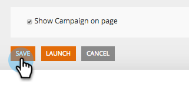

# Spara kampanjen som en mall {#save-your-campaign-as-a-template}

Har du någonsin ägnat tid åt att skapa den perfekta webbkampanjen? Du kan nu spara den som en mall för enkel återanvändning i framtiden.

1. Gå till **[!UICONTROL Web Campaigns]**.

   

1. Sök efter kampanjen som du vill spara som en mall.

   

1. Klicka på ikonen Redigera.

   

1. Markera **[!UICONTROL Use as template]** och klicka på **[!UICONTROL Save]**.

      

1. Så ja! Nästa gång du skapar en kampanj och väljer mall kan du kontrollera [!UICONTROL My Templates] på sidan Ange kampanjer för att se mallarna som du sparade.

   
