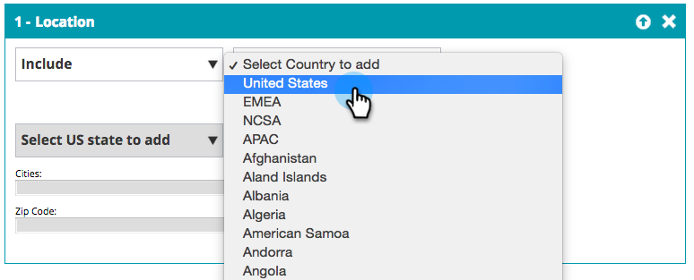

# Skapa ett enkelt webbsegment {#create-a-basic-web-segment}

Låt oss skapa ett grundläggande segment som riktar sig till alla webbesökare från USA och finanssektorn.

1. Gå till **[!UICONTROL Segments]**.

   

1. Klicka på **[!UICONTROL Create New]**.

   

1. Ange segmentnamnet.

   

1. Dra **[!UICONTROL Location]** från den högra menyn och släpp den i segmentredigeraren.

   

1. Välj ett land att lägga till i listrutan. Välj **USA**.

   

   >[!NOTE]
   >
   >Antalet städer är begränsat till 300 per segment.

1. Dra **[!UICONTROL Industries]** från den högra menyn och släpp den i segmentredigeraren.

   

1. Välj [!UICONTROL Industries] att lägga till i listrutan. Välj **[!UICONTROL Financial Services]Bransch**.

   

   Du har nu skapat ett grundläggande segment för alla potentiella kunder som besöker din webbplats från USA och finanssektorn.

1. Klicka på **[!UICONTROL Save]** om du vill spara segmentet eller **[!UICONTROL Save & Define Campaign]** om du vill gå till sidan Kampanjer.

   

Nu har ni segmenterat era besökare från USA och lagt till finanssektorn.

>[!MORELIKETHIS]
>
>[Webbsegment](/help/marketo/product-docs/web-personalization/using-web-segments/web-segments.md)
