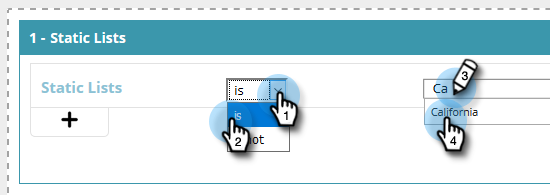

# Skapa ett segment med hjälp av en statisk lista {#create-a-segment-using-a-static-list}

Segmentera kända webbbesökare när de besöker er webbplats baserat på om de befinner sig i eller inte i någon av era Marketo [statiska listor](http://docs.marketo.com/display/DOCS/Understanding+Static+Lists).

1. Gå till **Segment**.

   

1. Klicka på **Skapa ny**.

   

1. Ange ett segmentnamn.

   

1. I Kända leads drar du **Statiska listor **över till arbetsytan.

   

1. Klicka på listrutan för att välja **is** eller **är inte** (beroende på vad du vill) och skriv namnet på den statiska listan.

   

1. Om du vill lägga till flera listor måste du skapa en ny rad för var och en genom att klicka på **+**. Om du bara vill ha en lista går du till [Steg 8](#eight).

   

1. För flera listor (eller flera&quot;is not&quot;-listor) upprepar du stegen som du lärde dig i [Steg 5](#five).

   

   >[!NOTE]
   >
   >Och/eller listrutan är just det. Klicka för att välja **och**, **eller** eller **och/eller**.

1. Klicka på **Spara** om du vill spara segmentet eller **Spara och definiera kampanj **om du vill spara och gå till sidan Kampanjer.

   

