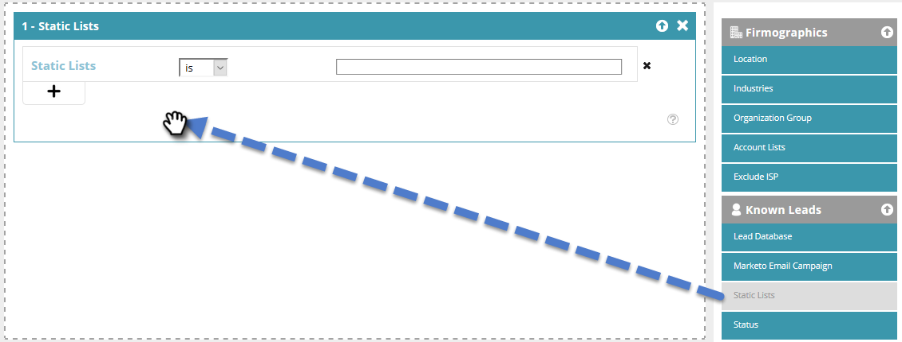

# Skapa ett segment med en statisk lista {#create-a-segment-using-a-static-list}

Segmentera kända webbbesökare när de besöker din webbplats baserat på om de befinner sig i eller inte finns i någon av dina [statiska listor](/help/marketo/product-docs/core-marketo-concepts/smart-lists-and-static-lists/static-lists/understanding-static-lists.md) för Marketo.

1. Gå till **[!UICONTROL Segments]**.

   

1. Klicka på **[!UICONTROL Create New]**.

   

1. Ange ett segmentnamn.

   

1. Dra **[!UICONTROL Static Lists]** till arbetsytan i Kända leads.

   

1. Klicka på listrutan för att välja **[!UICONTROL is]** eller **[!UICONTROL is not]** (beroende på vad du vill ha) och skriv namnet på den statiska listan.

   

1. Om du vill lägga till flera listor måste du skapa en ny rad för var och en genom att klicka på **+**. Om du bara vill ha en lista går du till [steg 8](#eight).

   

1. Om du har flera listor (eller flera&quot;inte&quot;-listor) upprepar du stegen som du lärde dig i [steg 5](#five).

   

   >[!NOTE]
   >
   >Och/eller listrutan är just det. Klicka på den för att välja **[!UICONTROL and]**, **[!UICONTROL or]** eller **[!UICONTROL and/or]**.

1. Klicka på **[!UICONTROL Save]** om du vill spara segmentet eller på **[!UICONTROL Save & Define Campaign]** om du vill spara och gå till sidan [!UICONTROL Campaigns].

   
