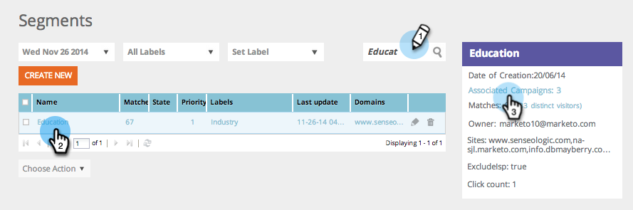

# Sök efter webbkampanjer som använder ett specifikt segment {#find-web-campaigns-that-are-using-a-specific-segment}

Söker du webbkampanjer som använder ett specifikt segment?

1. Gå till **Segment**.

   

1. Sök efter ett **segment**. Markera **segmentnamnet**. Klicka på **Associerade kampanjer** i den högra panelen för att visa de kampanjer som är associerade med det här specifika segmentet.

   

1. Visa de **kampanjer** som är associerade med det valda segmentet.

   

>[!MORELIKETHIS]
>
>Läs mer om [segment](/help/marketo/product-docs/web-personalization/using-web-segments/web-segments.md) och hur du [skapar ett enkelt segment](/help/marketo/product-docs/web-personalization/using-web-segments/create-a-basic-web-segment.md).
