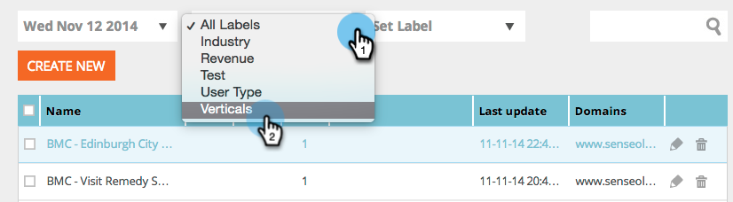

# Visa segment från en viss etikett {#view-segments-from-a-specific-label}

Vill du visa och filtrera segmenten efter en viss etikett?

## Filtrera efter befintliga etiketter {#filter-by-existing-labels}

Välj önskad etikett under listrutan Etiketter.

Supercool, lägg märke till att vi nu bara visar de segment som är kopplade till den valda etiketten?

