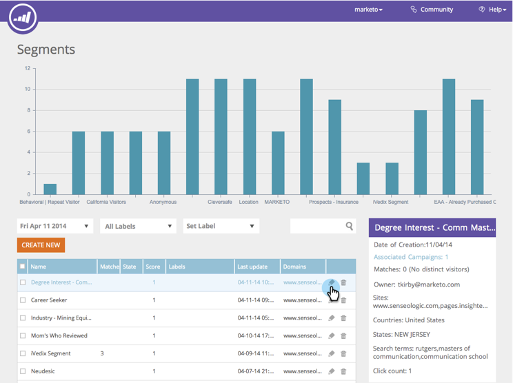

# Webbsegment {#web-segments}

## Visa segment {#view-segment}

På fliken Segment visas alla anpassade definierade segment som du ställer in baserat på olika attribut.  **Ett segment är en samling besökare som uppfyller de angivna villkoren på sidan&quot;Ställ in ett segment&quot;.**  Ett segment kan vara besökare från en viss bransch, plats eller baserat på besökarens aktivitet på plats.

Inom webbpersonalisering kan en besökare matcha mer än ett segment. Om det till exempel finns ett segment för besökare i USA och ett segment för finansföretag skulle en webbbesökare från Bank of America matcha **både** segmentet för besökare i USA och segmentet för finansföretag.

**DIAGRAM:**  På sidan Segment visas ett stapeldiagram över de valda segmenten utifrån antalet besökare från segmentet (y-axeln) och segmentnamnet (x-axeln).

<table> 
 <thead> 
  <tr> 
   <th colspan="1" rowspan="1">Namn</th> 
   <th colspan="1" rowspan="1">Beskrivning</th> 
  </tr> 
 </thead> 
 <tbody> 
  <tr> 
   <td colspan="1" rowspan="1"><strong>Namn</strong></td> 
   <td colspan="1" rowspan="1">Segmentets titel</td> 
  </tr> 
  <tr> 
   <td colspan="1" rowspan="1">
<strong>Matchar</strong>
</td> 
   <td colspan="1" rowspan="1">Antalet besökare som uppfyller de anpassade, definierade villkoren för segmentet</td> 
  </tr> 
  <tr> 
   <td colspan="1" rowspan="1"><strong>Ange kampanj</strong></td> 
   <td colspan="1" rowspan="1">Gör att du kan ställa in en Campaign CTA som är associerad med den valda söktermen</td> 
  </tr> 
  <tr> 
   <td colspan="1"><strong>Besökare</strong></td> 
   <td colspan="1">En förhandsgranskning av besökstabellen som är associerad med den valda söktermen</td> 
  </tr> 
  <tr> 
   <td colspan="1" rowspan="1"><strong>Clickstream</strong></td> 
   <td colspan="1" rowspan="1">Visar en tabell över besökarens aktivitet och URL-sökväg på webbplatsen och hur länge besökaren besökte varje sida </td> 
  </tr> 
 </tbody> 
</table>

Se [hur du skapar och visar segmentetiketter](label-your-segment.md)

**Segment - högerpanel**

Om du markerar ett segment i tabellen visas mer information om segmentet på den högra panelen.

Dessa uppgifter omfattar:

* Segmentets namn
* Segmentets skapandedatum
* De associerade kampanjerna visar vilka kampanjer som används i segmentet. Om du klickar på antalet reaktioner kommer du till kampanjsidan där kampanjkoden (Call to Action) för segmentet visas
* Antalet matchningar (antalet besökare som uppfyller segmentvillkoren) för segmentet och antalet distinkta (unika) besökare som matchade segmentet. När du klickar på den unika besökarlänken visas segmentets resultat på besökarens sida
* Segmentets ägare/användare som skapat det
* Domänwebbplatserna som är associerade med segmentet
* En kort sammanfattning av de valda villkoren för segmentet

## Aktivera eller inaktivera ett segment {#enable-or-disable-a-segment}

Om du vill aktivera eller inaktivera ett segment markerar du kryssrutan för det segmentet i tabellen och väljer åtgärden Aktivera eller Inaktivera i listrutan Välj åtgärd längst ned i tabellen. När ett segment är inaktiverat visas ordet&quot;inaktivera&quot; under kolumnen Läge.

## Skapa segment {#create-segments}

Segmentet som du skapar uppfyller alla specifika villkor som du anger på sidan **Ställ in segment** . Ni kan anpassa era segment baserat på en kombination av kriterier också, och inrikta er på en viss målgrupp i kampanjen.

Skapa ett nytt segment

Klicka på **Skapa ny** under diagrammet på sidan **Segment** . Följande skärm visas.

Definiera allmänna parametrar för ditt segment:

1. 

   * **Namn:**  Ge segmentet ett namn.
   * **Beskrivning:**  Ge en mer detaljerad förklaring av segmentvillkoren.
   * **Domäner:**  Markera den eller de domäner som du vill inkludera i segmentet.
   * **Segmentregellogik:**  Välj en AND/OR-logik för att skapa varje segmenteringsattribut
   * **Timing:** Definiera nivån på besökarens engagemang i kampanjen

      * **Vid inträde**: Engagera från besökaren som kommer till webbplatsen
      * **Efter 1:a till 9:e klickningen**: Engagera besökaren efter ett visst antal klick på webbplatsen

>[!TIP]
>
>**Segmentregellogik**
>
>Det finns tre filteralternativ:
>
>1. Använd alla filter (1, 2 och 3...)
>1. Använd filter (1 eller 2 eller 3..)
>1. Avancerade filter (med och/eller uttryck) >
   >    1. >    
   >       

      >Med avancerade filter kan du styra segmentvillkoren. Ange filternumren avgränsade med &quot;och&quot; och &quot;eller&quot;.  >
      >        * 1, 2 och 3
      >        * 1 eller 2 eller 3

      >
      Blandning av&quot;och&quot; och&quot;eller&quot; kräver parenteser för att förtydliga logiks avsikt. t.ex. &quot;1 eller 2 och 3&quot; skall skrivas som något av följande:  >
      * 1 och (2 eller 3)
      * (1 och 2) eller 3

      Kapslade parenteser accepteras för mer komplicerad logik, t.ex.  >
      * (1 och 2) eller (3 och 4)
      * 1 och (2 eller (3 och 4))

      Kontrollera logiken efter infogning, borttagning eller sortering.

Dra och släpp segmentattribut från den högra kolumnen i segmentredigeraren till vänster:

### Firmographics {#firmographics}

**Plats**

Dra och släpp **Location **i segmentredigeraren.

* Välj bland följande parametrar:

   * **Inkludera **- Välj om du vill att kampanjen ska inkludera eller exkludera en plats.
   * **Välj land att lägga** till - I listrutan väljer du det land du vill inkludera i segmentet. Landsnamnet visas till höger. Du kan välja flera länder.

När landet har lagts till kan du även ange segmentets stat, ort och postnummer.

* **Välj delstat eller provins som ska läggas till** - I listrutan väljer du delstat eller kanadensisk provins som du vill inkludera. Du kan göra flera val.
* **Postnummer** - Ange det postnummer du vill inkludera i ditt segment.
* **Städer** - Ange den ort eller de städer som du vill inkludera. Använd ett semikolon mellan städer.

>[!TIP]
>
>**Vilka segmentvillkor väljer jag? &quot;AND&quot; eller&quot;OR&quot;? **OR fungerar som ett extra alternativ i varje fält. Prospekt behöver bara uppfylla ett av de kriterier som valts ut i varje fält för att vara kvalificerade för segmentet. (Prospekt kan till exempel antingen komma från USA. *eller* från försvarsindustrin). AND fungerar som en extra obligatorisk parameter som måste uppfyllas för det här segmentet. (Prospekten måste till exempel vara både från USA och försvarsindustrin). Inom varje segmenteringsprofil kan varje separat fält fungera som både och, antingen&quot;AND&quot; eller&quot;OR&quot; beroende på vilket segmentvillkor som valts.

**Branscher** Under avsnittet **Profilsegmentering** markerar du kryssrutan bredvid **Bransch**.

* Välj bland följande parametrar:

   * **Innehåller** - Välj om du vill att segmentet ska inkludera eller exkludera en bransch.
   * **Välj Branscher som ska läggas till** - Välj den bransch som du vill inkludera i segmentet. Branschen visas under listrutan. Du kan välja flera branscher.

**Organisationsgrupp**

Markera kryssrutan bredvid **Organisationsgrupp under avsnittet** Profilsegmentering **.**

* Välj bland följande alternativ i listrutan:

   * Fortune 500 - Omfattar endast Fortune 500-företag i detta segment
   * Fortune 1000 - Omfattar endast Fortune 1000-företag i detta segment
   * Global 2000 - Innefattar Global 2000-företagen i detta segment
   * Enterprise - Innehåller organisationer med fler än 1 000 anställda och intäkter över 250 miljoner dollar
   * Små och medelstora företag - Inkluderar endast små och medelstora företag i detta segment

**Namngivna konton**

**Organisationer**

* 

   * **Kommer från dessa företag (specifika namn)**

      * Välj företag att rikta in på i listrutan Välj företag att lägga till.
      * Du kan ange det exakta organisationsnamn som du vill ha som mål. *Det *rekommenderas alltid att du använder namngivna kontolistor i stället för att skriva in namnen manuellt för att få bättre matchningar (se nedan).*

**Namngiven kontolista**

Välj från en lista [över](../../../product-docs/web-personalization/account-based-web-marketing/create-a-new-account-list.md) namngivna konton om du vill segmentera målkonton för nycklar

>[!NOTE]
>
>Siffran inom hakparenteser bredvid namnet Namngiven kontolista används som indexreferens för listan för API:t [för webbpersonalisering](http://developers.marketo.com/documentation/websites/rtp-js-api/).

**Exkludera ISP**

Utesluter Internetleverantörer (ISP) från segmentet.

### Kända personer {#known-people}

**Databas**

Webbpersonalisering integreras med er Marketo-databas så att ni kan segmentera och personalisera kampanjer utifrån kända personattribut och data.

Välj Databas och välj ett persondatafält i listrutan. Välj **+** för att lägga till fält i listrutan.

Du kan lägga till eller ta bort persondatafält från Kontoinställningar > Databas

>[!TIP]
>
>Skapa segmentkriterier enligt alla persondatafält från Marketo, t.ex. Befattning, Poäng; Roll; osv..
>
>Exempel: &quot;Jobbtitel är lika med CMO&quot; och &quot;bakgrundsmusik är mindre än eller lika med 50&quot;

**Marketo Email Campaign** Segment och personalisera kampanjer genom att mejla till en besökare som klickar på ett Marketo-e-postmeddelande och anländer till webbplatsen. Segmentera efter Marketo-programnamn eller kampanjnamn och fortsätt konversationen från e-post till webben. Välj + för att lägga till fält från listrutan.

**Status**

Definiera ditt segment utifrån en potentiell kunders status: känd eller anonym.

* 

   * Känd - Välj det här alternativet i listrutan för kända besökare. En besökare är känd när de skickar in ett formulär på din webbplats och visas på sidan Webbpersonalisering.
   * Anonym - Välj det här alternativet i listrutan för anonyma besökare.

### Beteende {#behavioral}

**Besök -** Definiera ditt segment utifrån besökarens beteende eller identifiering.

* 

   * Antal besök - Välj det här alternativet i listrutan för att ange antalet besök för potentiella kunder på webbplatsen.

      * Välj Lika med, Lika med eller Större än, eller Lika med eller Mindre än i listrutan.
   * Specifika besök - Välj det här alternativet i listrutan för att ange en specifik besökare.

      * Ange det besökarnummer du vill spåra i textrutan till höger. Det unika besökaridentifieringsnumret för webbpersonalisering visas när du klickar på en besökare (på besökarsidan) och på Ställ in kampanj på den högra panelen. Besökar-ID:t finns i avsnittet Avancerade inställningar. Besökar-ID:t finns också i URL:en (t.ex. VISITOR=JZZJIFJNUI60PZ8Y97BHTY9BL8PKWS).

**Sökvillkor** - Definiera ett segment enligt en potentiell kunders sökvillkor.

* 

   * Besökaren sökte efter - I listrutan väljer du de termer som du vill spåra från besökarens sökning eller lägger till egna söktermer. (Jokertecknet * behövs inte för söktermer eftersom det är inställt som standard för att innehålla fraser som innehåller söktermen).

**Referenser** - Lägg till URL:er som besökaren refererades till.

* 

   * Välj hänvisningar att lägga till - Välj de hänvisningswebbplatser du vill spåra i listrutan eller lägg till din egen hänvisning. När du har valt detta alternativ visas hänvisningarna i rutan nedan. (Användning av * som jokertecken tillåts)

**Inkludera sidor** - Spåra specifika sidor som besökts på webbplatsen.

* 

   * URL-matchningar - Lägg till URL:en för specifika webbsidor som du vill spåra. Du kan lägga till flera URL-adresser genom att separera dem med ett semikolon. (Användning av * som jokertecken är tillåtet).

**Uteslut sidor** - Uteslut specifika sidor som du inte vill matcha i segmentet. (Användning av * som jokertecken är tillåtet).

* 

   * 

      * URL:en matchar inte - Lägg till URL:en för specifika webbsidor som du vill utesluta från spårning. Du kan lägga till flera URL-adresser genom att separera dem med ett semikolon

### Enhet/webbläsare {#device-browser}

**Mobiloperativsystem**

Dra och släpp det mobila operativsystemet i segmentredigeraren

* **Besökartyp **
   **Mobiloperativsystem** - Välj ett eller flera mobila operativsystem i listrutan. Det valda mobiloperativsystemet visas nedan.

   * Besökaren använder vilken mobil enhet som helst ** **
   * Besökaren använder den specifika enheten/operativsystemet
   * Besökaren använder inte någon mobil enhet

* **Enhet** - I listrutan väljer du en eller flera enheter (Apple, Samsung, LG, HTC, Nexus, Blackberry osv.). De valda enheterna visas nedan.

**Webbläsare**

Målgrupp som använder specifika webbläsartyper och/eller versioner.

* 

   * Typ av webbläsare - Välj en eller flera webbläsare i listrutan. De valda webbläsarna visas nedan.
   * Webbläsarversion - Ange den webbläsarversion som du vill lägga till i segmentet. Du kan välja flera versioner genom att separera dem med kommatecken. (Användning av * som jokertecken är tillåtet).

### API {#api}

**Datahändelser** - Segmentera besökare som utlöser specifika anpassade datahändelser

Lägg till det händelsevärde som du vill ha som mål. t.ex. från datakällor från tredje part.

**API för användarkontext**

Anrop till API för webbanpassning [innehåller mer information.](http://developers.marketo.com/documentation/websites/rtp-user-context-api/)

>[!TIP]
>
>**Använda jokertecken - **När du vill inkludera ett sökord eller en URL som innehåller något i det, dvs. &quot; [google.com](http://google.com)&quot; eller &quot;söktermsprodukt&quot;, kallar vi det här ett jokertecken och det ska läggas in med en asterisk - den här lilla killen* - i varje ände. Så allt som kommer från [google.com](http://google.com) ska anges som * [google.com](http://google.com)*

## Redigera segment {#edit-segments}

Du kan redigera ett segment som har skapats.

1. Om du vill redigera ett segment går du till **Segment**.

   

1. I **segmenttabellen** klickar du på redigeringsikonen ( ) för det segment som du vill redigera. Sidan **Ställ in segment** öppnas med det valda segmentet.
1. Gör de ändringar du vill i segmentet.
1. Klicka på **Spara**.

## Ta bort segment {#delete-segments}

Du kan ta bort segment som du har skapat.

1. Markera ett segment på sidan **Segment** ovan.
1. Klicka på borttagningsikonen (  ) för segmentet** **du vill ta bort.
1. Ett bekräftelsemeddelande visas som bekräftar att du håller på att ta bort **segmentet**.

>[!NOTE]
Du kan inte ta bort ett segment som är associerat med en kampanj. Först måste ni ta bort kampanjen och sedan segmentet.

Bra! Nu när ni förstår segmentavsnittet kan vi lära oss mer om kampanjer.

>[!MORELIKETHIS]
* [Skapa ett enkelt webbsegment](create-a-basic-web-segment.md)
* [Skapa en ny webbkampanj för dialog](../../../product-docs/web-personalization/working-with-web-campaigns/create-a-new-dialog-web-campaign.md)
* [Skapa en ny webbkampanj i zonen](../../../product-docs/web-personalization/working-with-web-campaigns/create-a-new-in-zone-web-campaign.md)
* [Skapa en ny webbkampanj för widget](../../../product-docs/web-personalization/working-with-web-campaigns/create-a-new-widget-web-campaign.md)

