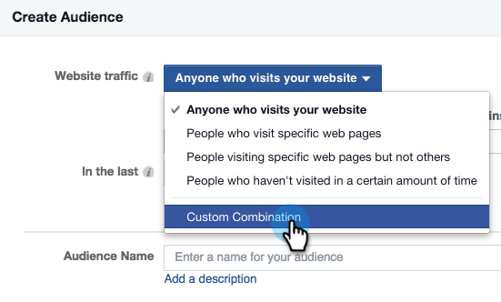
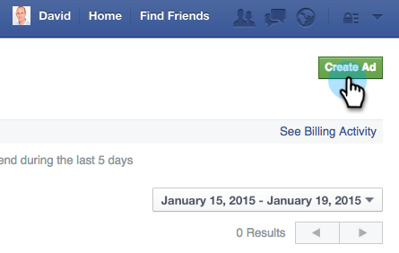

# Anpassad marknadsföring på Facebook {#personalized-remarketing-in-facebook}

Med personligt anpassad marknadsföring kan ni återengagera era användare med hjälp av RTP-data och kraften i Facebook Remarketing.

>[!PREREQUISITES]
>
>* Slutför installationen av [Återmarknadsföring med webbpersonaliseringsdata](retargeting-with-web-personalization-data.md)
>* Granska  [Facebook-dokumentationen om anpassade målgrupper](https://developers.facebook.com/docs/ads-for-websites/website-custom-audiences/getting-started#install-the-pixel)och ommarketing

>

## Skapa en publik i Facebook {#creating-an-audience-in-facebook}

1. Gå till fliken [Målgrupp](https://www.facebook.com/ads/audience_manager) i Ads Manager på Facebook.
1. Klicka på **Verktyg** och välj **Publiker**.

   

1. Klicka på **Skapa en anpassad målgrupp**.

   

1. Välj **Webbplatstrafik**.

   

1. I listan Webbplatstrafik väljer du** Anpassad kombination**.

   

1. Välj **Händelse** i listan Inkludera.

   

1. Välj **RTP Remarketing **och välj en parameter i händelselistan.

   

1. I det här exemplet väljer du Bransch som ska innehålla **Utbildning**. Ange **Utbildning** och redigera **De sista** ska vara 180 dagar. Ange målgruppsnamn: **Skolbranschen**. Klicka på **Skapa målgrupp**.

   

1. Du har nu skapat en ny anpassad målgrupp med RTP-data på Facebook.

   

## RTP-datapunkter på Facebook {#rtp-data-points-in-facebook}

<table> 
 <tbody> 
  <tr> 
   <th>Händelsenamn</th> 
   <th> </th> 
  </tr> 
  <tr> 
   <td>RTP Remarketing</td> 
   <td> 
    
 
     <table> 
      <tbody> 
       <tr> 
        <th>Parameter</th> 
        <th>Värde</th> 
       </tr> 
       <tr> 
        <td>ABM-lista</td> 
        <td>(Namn på kontobaserad lista)</td> 
       </tr> 
       <tr> 
        <td colspan="1">Kategori</td> 
        <td colspan="1">
Fortune 500

Fortune 1000

Global 2000
</td> 
       </tr> 
       <tr> 
        <td colspan="1">Grupp</td> 
        <td colspan="1">
Enterprise

SMB
</td> 
       </tr> 
       <tr> 
        <td>Bransch</td> 
        <td>
Försvar

Utbildning

Finansiella tjänster

Offentlig sektor

Sjukvård, farmakologi, bioteknik

Programvara och Internet

osv.. (enligt RTP:s branschalternativ)
</td> 
       </tr> 
       <tr> 
        <td colspan="1">Segmenterad publik</td> 
        <td colspan="1">(Namn på segmenterad publik som skapats i RTP)</td> 
       </tr> 
      </tbody> 
     </table> 
    
</td> 
  </tr> 
 </tbody> 
</table>

## Rikta in er målgrupp med en annons {#target-your-audience-with-an-ad}

Mer information finns i [Facebooks dokumentation](https://developers.facebook.com/docs/ads-for-websites/website-custom-audiences/getting-started#target-your-audience).

1. Gå till annonshanteraren och klicka på **Skapa annons**.

   

1. Välj **Skicka personer till din webbplats** som mål för din kampanj.

   

1. Ange webbplatsens URL.

   

1. Skapa er annonsuppsättning. Välj en anpassad målgrupp i listan över målgrupper som du har skapat, till exempel Education Industry.

   

1. Välj alla andra alternativ för annonsuppsättning, ange din budget och definiera era annonskreatörer.

   

1. Nu har ni alla en personaliserad marknadsföringskampanj på Facebook.

>[!MORELIKETHIS]
>
>* [Återannonsering med webbpersonaliseringsdata](retargeting-with-web-personalization-data.md)
>* [Personaliserad marknadsföring i Google](personalized-remarketing-in-google.md)

>

