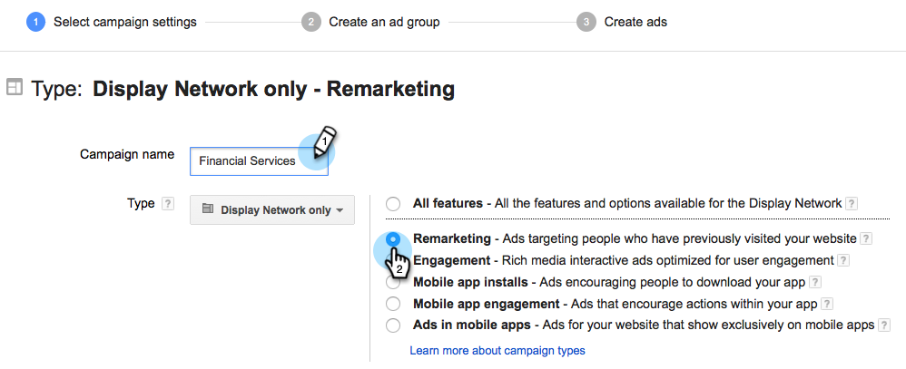

# Personaliserad marknadsföring i Google {#personalized-remarketing-in-google}

Med personligt anpassad marknadsföring kan ni återengagera era användare med hjälp av RTP-data och Google Analytics med Google Display Network.

>[!PREREQUISITES]
>
>* Slutför konfigurationen av [återmarknadsföring med webbpersonaliseringsdata](retargeting-with-web-personalization-data.md)
>* Granska [kommentarsinformation med hjälpdokumentationen](https://support.google.com/analytics/topic/2611283?hl=en&amp;ref_topic=3413645) för Google Analytics

>

## Creating a Remarketing Audience in Google {#creating-a-remarketing-audience-in-google}

1. Logga in på Google Analytics. Klicka på **Admin**, **Konto**, **Egenskap**. Klicka på **Målgruppsdefinitioner** och **Målgrupper**.

   

1. Klicka **+Ny publik**.

   

1. **Länkkonfiguration**: Länka till ditt Google Adwords-konto
1. **Definiera målgrupp**: Klicka på **Skapa nytt**.

   

1. I Audience Builder klickar du på **Sequences** och **letar upp RTP-data** under Custom Dimensions, Custom Variables, Events.

>[!TIP]
>
>Hur hittar man RTP-data i Analytics för att bygga upp sin målgrupp?
>
>I Google Analytics:
>
>* Anpassade variabler: Organisation, industri
>* Händelsekategori: Segment, Insightera-CTA, RTP-Remarketing
>* Händelseetikett: Segmentnamn, kampanjnamn, segmenterat målgruppsnamn

>
>
I Google Universal Analytics:
>
>* Anpassade Dimensioner: Organisation, bransch, kategori (Fortune 500,1000, Global 2000), grupp (Enterprise, SMB), ABM-lista (lista över namngivna konton)
>* Händelsekategori: RTP-Segment, RTP-Campaign RTP-Remarketing
>* Händelseetikett: Segmentnamn, kampanjnamn, segmenterat målgruppsnamn

>

**Exempel på återmarknadsföring från RTP-segmenterade målgruppsdata**

1. Klicka på **Sekvenser.**
1. Välj **Händelseetikett.**
1. Ange **namnet på segmenterad publik** (så som det visas i RTP).
1. Klicka på **Använd**.

**Exempel på publik från RTP:s branschdata**

1. Klicka på **Sekvenser**.
1. Välj** RTP-Industry**.
1. Ange **namnet på branschen** (t.ex. Finansiella tjänster, utbildning..).
1. Klicka på **Använd**.
1. Ange ett **målgruppsnamn**. Klicka på **Spara**.

## Skapa en reklamkampanj för återmarknadsföring i Google Adwords {#create-a-remarketing-ad-campaign-in-google-adwords}

1. Logga in på **Google Adwords**. Klicka på **Kampanjer** och välj **Visa endast** nätverk.

   

1. Ange **kampanjnamn**, välj **Typåtermarknadsföring.**

   

1. Ange **annonsgruppnamn,** ange **Förbättrad CPC** och välj **Marknadsföringslista**.

   

1. Klicka på Spara och fortsätt.
1. Lägg till din bild- eller textannons och starta din marknadsföringskampanj.

   

>[!NOTE]
>
>**Relaterade artiklar**
>
>* [Återannonsering med webbpersonaliseringsdata](retargeting-with-web-personalization-data.md)
>* [Personaliserad marknadsföring på Facebook](personalized-remarketing-in-facebook.md)

