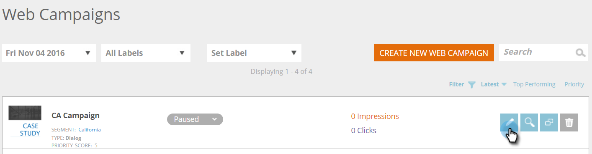

# Skapa en ny dialogrutewebbkampanj {#create-a-new-dialog-web-campaign}

## Skapa en dialogrutewebbkampanj {#create-a-dialog-web-campaign}

Skapa en webbkampanj för att personalisera ert webbinnehåll i realtid och leverera rätt budskap till rätt användare vid rätt tidpunkt.

En webbkampanj är en anpassad reaktion som är kopplad till ett visst segment. Reaktionen kan vara en dialogruta på webbplatsen, en [zonersättning](create-a-new-in-zone-web-campaign.md), en [widgetfunktion](create-a-new-widget-web-campaign.md)eller en e-postavisering.

1. Gå till **Webbkampanjer**.

   

1. Välj **Skapa ny webbkampanj**.

   

1. Välj webbkampanjtypen **Dialogruta**. Designa och lägg till din kreativitet i redigeraren. Klicka på **Förhandsgranska** för att se hur webbkampanjen kommer att reagera på din webbplats.

   

<table> 
 <thead> 
  <tr> 
   <th colspan="1" rowspan="1">Namn</th> 
   <th colspan="1" rowspan="1">Beskrivning</th> 
  </tr> 
 </thead> 
 <tbody> 
  <tr> 
   <td colspan="1"><strong>Visa på</strong></td> 
   <td colspan="1">Gör att du kan <a href="http://docs.marketo.com/display/DOCS/Set+How+Your+Web+Campaign+Displays" rel="nofollow">anpassa när och hur</a> webbkampanjen visas.</td> 
  </tr> 
  <tr> 
   <td colspan="1" rowspan="1"><strong>Dialogruteformat</strong></td> 
   <td colspan="1" rowspan="1"> 
    <ul> 
     <li>Modern trimning - en elegant och distinktiv dialog med halvgenomskinlig svart trimning och rundade hörn</li> 
     <li>Modern Trim II - En elegant och distinkt dialog med ljusskugga, rundade hörn och stängningsknapp</li> 
     <li>Genomskinlig - En helt genomskinlig dialogruta som är idealisk för genomskinliga (png) bilder för att anropa åtgärder. </li> 
     <li>Grundläggande - En enkel formatdialogruta med tjockare rubrikutrymme som uppfyller de grundläggande behoven i dialogrutan.</li> 
    </ul></td> 
  </tr> 
  <tr> 
   <td colspan="1"><strong>Animera in/ut</strong></td> 
   <td colspan="1">Ange vid dialoginträde och/eller -avslutning. Välj effekt (släpp, blind, glid, toning, ingen effekt), varaktighet (i sekunder) och riktning (upp, ned, vänster, höger).</td> 
  </tr> 
  <tr> 
   <td colspan="1" rowspan="1">
<strong>Position</strong>
</td> 
   <td colspan="1" rowspan="1">Välj ett av de nio alternativen för dialogrutans position på sidan. Om du till exempel markerar den mittersta rutan visas dialogrutan mitt på skärmen.</td> 
  </tr> 
  <tr> 
   <td colspan="1" rowspan="1">
<strong>Efter koordinater</strong>

 
</td> 
   <td colspan="1" rowspan="1">Om du vill ha fler placeringsalternativ för dialogrutan markerar du kryssrutan Positioneringskoordinater och anger de exakta skärmkoordinaterna (vågrät, lodrät) där du vill att dialogrutan ska visas.</td> 
  </tr> 
  <tr> 
   <td colspan="1"><strong>Knappfyllning</strong></td> 
   <td colspan="1">Anpassa spärrknappen med färg, stil och position. Du kan också använda en egen knapp genom att länka till den i rutan Bild-URL.</td> 
  </tr> 
  <tr> 
   <td colspan="1"><strong>Fäst</strong></td> 
   <td colspan="1">Genom att markera kryssrutan förblir dialogrutan på plats, utan tidsbegränsning, tills den stängs av användaren och visas på alla sidor under besökarens session.</td> 
  </tr> 
  <tr> 
   <td colspan="1"><strong>Modal</strong></td> 
   <td colspan="1">Ger mer fokus på dialogrutan och öppnar den med en mörkare bakgrund bakom dialogrutans fönster, vilket ökar användarnas medvetenhet om dialogrutan.</td> 
  </tr> 
  <tr> 
   <td colspan="1"><strong>Modal Color</strong></td> 
   <td colspan="1">Anpassa den modala färgen och opaciteten.</td> 
  </tr> 
  <tr> 
   <td colspan="1"><strong>Timeout </strong></td> 
   <td colspan="1">Antalet sekunder som dialogrutan aktiveras innan den tonas ut.</td> 
  </tr> 
  <tr> 
   <td colspan="1"><strong>Sidhuvudsfärg</strong></td> 
   <td colspan="1">Ställ in den önskade färgen på dialogrutans rubrikfält. Färgen kan väljas från ett färgdiagram eller anges som en hexadecimal färgkod. </td> 
  </tr> 
  <tr> 
   <td colspan="1"><strong>Bakgrundsfärg för innehåll </strong></td> 
   <td colspan="1">Ställ in bakgrundsfärgen för dialogrutan på den färg du vill använda. Färgen kan väljas från ett färgdiagram eller anges som en hexadecimal färgkod. </td> 
  </tr> 
  <tr> 
   <td colspan="1"><strong>Dialogrutans titel</strong></td> 
   <td colspan="1">Lägg till en rubrik i dialogrutans namnlist.</td> 
  </tr> 
  <tr> 
   <td colspan="1"><strong>Bredd och höjd</strong></td> 
   <td colspan="1">Välj pixelstorlek för dialogrutan.</td> 
  </tr> 
  <tr> 
   <td colspan="1"><strong>Automatisk bredd</strong></td> 
   <td colspan="1">Om du markerar den här kryssrutan kan dialogrutan anpassas automatiskt till innehållets bredd.</td> 
  </tr> 
  <tr> 
   <td colspan="1"><strong>Skalbar </strong></td> 
   <td colspan="1">Om du markerar kryssrutan för att ändra storlek på dialogrutan kan användaren ändra storlek på den.</td> 
  </tr> 
  <tr> 
   <td colspan="1"><strong>RTF-redigerare</strong></td> 
   <td colspan="1">
Med RTF-redigeraren kan du formatera, länka och infoga bilder. <a href="using-the-web-personalization-rich-text-editor.md">Läs mer här</a>.
</td> 
  </tr> 
  <tr> 
   <td colspan="1"><strong>Förhandsgranska på plats</strong></td> 
   <td colspan="1">Förhandsgranska kampanjer innan de startas.  
    <ul> 
     <li>URL - Ange en exempel-URL där kampanjen körs för att se ett förhandsgranskningsexempel på hur kampanjen skulle se ut live.</li> 
     <li>Enhet - Förhandsgranska hur kampanjen kommer att visas per enhet: Stationär dator, Mobile Portrait, Mobile Landscape, Tablet Portrait, Portrait Landscape. </li> 
     <li>Förhandsgranska - Klicka på <strong>Förhandsgranska </strong>för att öppna ett nytt fönster med exempel-URL:en för att se hur kampanjen reagerar. </li> 
     <li>Dela - Använd knappen Dela för att skicka ett e-postmeddelande till en kollega med en länk för att se proxykampanjen.</li> 
    </ul></td> 
  </tr> 
 </tbody> 
</table>

>[!TIP]
>
>Snabba upp och förenkla framtagningen av kampanjer genom att använda våra [inbyggda mallar](../../../product-docs/web-personalization/using-templates/using-templates-to-create-web-campaigns.md) eller genom att [spara din befintliga kampanj](../../../product-docs/web-personalization/using-templates/using-templates-to-create-web-campaigns.md) som en mall för återanvändning.

## Redigera en webbkampanj {#edit-a-web-campaign}

1. På sidan **Webb** **Kampanjer** klickar du på **Redigera** i webbkampanjen.

>[!NOTE]
>
>Använd filterfunktionen  för att göra det enklare att hitta den webbkampanj du vill ha.

## Förhandsgranska en webbkampanj {#preview-a-web-campaign}

1. På sidan **Webbkampanjer** klickar du på **Förhandsgranska** på den webbkampanj du vill visa.

## Klona en webbkampanj {#clone-a-web-campaign}

Se [Klona en webbkampanj](clone-a-web-campaign.md).

## Ta bort en webbkampanj {#delete-a-web-campaign}

1. På sidan **Webbkampanjer** klickar du på **Ta bort **på den webbkampanj som du vill ta bort.

   

1. Ett bekräftelsemeddelande visas som bekräftar om du vill ta bort webbkampanjen.

>[!MORELIKETHIS]
>
>* [Skapa en ny webbkampanj i zonen](create-a-new-in-zone-web-campaign.md)
>* [Skapa en ny webbkampanj för widget](create-a-new-widget-web-campaign.md)

