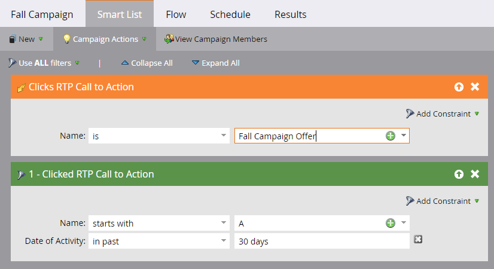

# Definiera en smart lista för webbpersonaliseringsaktiviteter {#define-a-smart-list-for-web-personalization-activities}

Du kan använda webbpersonaliseringsaktiviteter i filter och utlösare när du definierar en smart lista i en smart kampanj. Här vill du fånga alla som har klickat på ett webbpersonaliseringsanrop (kampanj).

Använd en utlösare för att skicka ett e-postmeddelande eller en varning, eller ändra ett värde eller poäng baserat på besökare som klickade och var engagerade i ett webbpersonaliseringsanrop. Du kan även filtrera och visa leads som klickats på ett webbpersonaliseringsanrop.

1. Klicka på fliken **Smart List** i den smarta kampanjen.

   

   >[!NOTE]
   >
   >**Djupdykning**
   >
   >
   >Smarta listor kan göra fantastiska saker. Läs mer i [Djupdykning för smart lista](../../../product-docs/core-marketo-concepts/smart-campaigns/understanding-smart-campaigns.md).

1. Sök efter utlösaren och dra och släpp sedan utlösaren på arbetsytan.

   

   >[!NOTE]
   >
   >En smart kampanj med utlösare körs i utlösarläge. Den körs på en person i taget baserat på händelser som utlösts och filter som lagts till.

1. Klicka på listrutan och välj en operator.

   

   >[!CAUTION]
   >
   >Rödaktiga streck indikerar ett fel. Om den inte korrigeras blir kampanjen ogiltig och den kommer inte att köras.

1. Definiera utlösaren.

   

1. Lägg till filter efter behov.

   

   >[!TIP]
   >
   >I en smart kampanj med både utlösare och filter ligger utlösarna överst. När det aktiveras kommer endast personer som uppfyller filtervillkoren att gå igenom flödet.

   >[!NOTE]
   >
   >Med flera utlösare går en person igenom flödet om någon av utlösarna aktiveras.

   [Definiera smart lista för smart kampanj | Grupp](../../../product-docs/core-marketo-concepts/smart-campaigns/creating-a-smart-campaign/define-smart-list-for-smart-campaign-batch.md)

   >[!MORELIKETHIS]
   >
   >
   >    
   >    
   >    * [Definiera smart lista för smart kampanj | Grupp](../../../product-docs/core-marketo-concepts/smart-campaigns/creating-a-smart-campaign/define-smart-list-for-smart-campaign-batch.md)
   >    * [Lägg till ett flödessteg i en smart kampanj](../../../product-docs/core-marketo-concepts/smart-campaigns/flow-actions/add-a-flow-step-to-a-smart-campaign.md)
   >    * [Definiera en smart lista för aktiviteter med prediktivt innehåll](../../../product-docs/predictive-content/define-a-smart-list-for-predictive-content-activities.md)

Om du vill köra kampanjen på en uppsättning personer samtidigt ska du lära dig hur du gör .