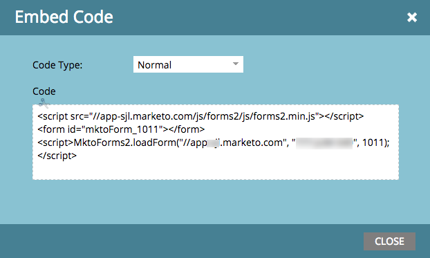

# Bädda in ett formulär i en webbkampanj {#embed-a-form-into-a-web-campaign}

Se hur du kan bädda in ett Marketo-formulär i en webbkampanj (Dialog, In Zone eller Widget).

1. Högerklicka på ett godkänt formulär. Välj **[!UICONTROL Embed Code]**.

   

1. Kopiera koden.

   

1. Gå till [!DNL Web Personalization] om **[!UICONTROL Web Campaigns]**.

   

1. Klicka på **[!UICONTROL Create New Campaign]**.

   

1. Klicka på ikonen HTML i RTF-redigeraren.

   

1. Klistra in formulärinbäddningskoden i [!UICONTROL HTML Source Editor]. Klicka på **[!UICONTROL Update]**.

   

1. Formuläret visas inte i redigeringsvyn, men du kan förhandsgranska det för att se hur det kommer att visas i en kampanj.

1. Klicka på **[!UICONTROL Launch]** för att starta kampanjen.

   >[!NOTE]
   >
   >Ändringar i formulärfälten måste göras i Marketo marknadsföringsaktiviteter i Redigera utkast till formuläret.

## Tre sätt att lägga till en bakgrundsbild i ett formulär {#three-ways-to-add-a-background-image-to-a-form}

Om du vill lägga till en bakgrundsbild i formuläret kan du:

* Redigera CSS för ett formulärtema
* Ändra dialogrute- eller widgetfärger i Ange kampanj
* Lägga till CSS-kod i skriptet

Mer information om hur du redigerar CSS för ett formulärtema finns i [den här artikeln](/help/marketo/product-docs/demand-generation/forms/form-design/edit-the-css-of-a-form-theme.md).

Så här ändrar du dialogrute- eller widgetfärger i Ange kampanj:

1. Välj en kampanjtyp för dialog och en dialogstil, rubrikfärg och bakgrundsfärg i Rich Text Editor för att anpassa formulärets bakgrundsfärger. Klicka på **[!UICONTROL Save]**.

   

1. Här är ett exempel på hur en dialogstil för modern trimning ser ut med en ljuslila rubrik- och bakgrundsfärg.

   

Så här lägger du till CSS-kod i skriptet:

1. Klicka på ikonen HTML i RTF-redigeraren.

   

1. Klistra in formulärinbäddningskoden med bakgrundskoden i [!UICONTROL HTML Source Editor]. Klicka på **[!UICONTROL Update]**.

   

1. Klicka på **[!UICONTROL Preview]** om du vill se hur det återges i en kampanj (formuläret visas inte i redigerarvyn). Här är ett exempel på hur formulärkoden ovan återges i en kampanj med en bakgrundsbild.

   

>[!MORELIKETHIS]
>
>* [Redigera CSS för ett formulärtema](/help/marketo/product-docs/demand-generation/forms/form-design/edit-the-css-of-a-form-theme.md)
>* [Visa tackmeddelande utan en uppföljningsstartsida](https://developers.marketo.com/blog/show-thank-you-message-without-a-follow-up-landing-page/)
>* [Forms 2.0](https://experienceleague.adobe.com/sv/docs/marketo-developer/marketo/javascriptapi/forms-api-reference)
