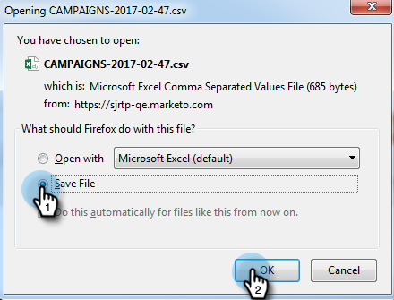
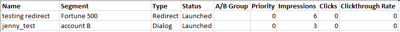

# Exportera webbkampanjdata {#export-web-campaign-data}

Följ de här enkla stegen för att exportera webbkampanjdata.

1. Gå till **Webbkampanjer**.

   

1. Klicka på ikonen Exportera CSV längst upp till höger på sidan.

   

1. Öppna eller spara filen.

   

1. Visa din fil för att se användbar statistik.

   
