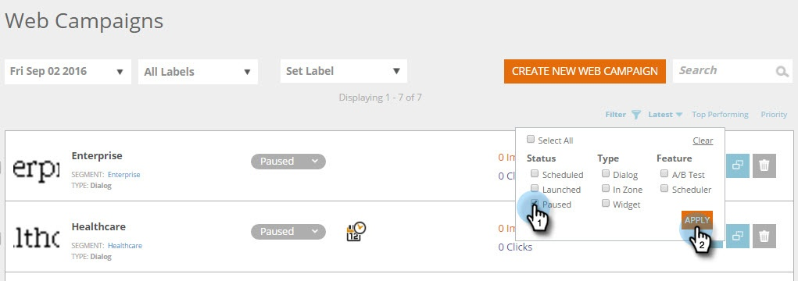

# Filtrera webbkampanjer {#filter-web-campaigns}

När du har skapat hundratals webbpersonaliseringskampanjer är det verkligen bra att kunna använda filter för att visa endast de du är intresserad av.

1. Gå till **Webbkampanjer.**

   

1. Klicka på **Filter** på webbkampanjsidan.

   

1. Markera kryssrutan för den status och/eller typ av kampanj som du vill filtrera efter, till exempel **Pausad** eller **Dialog**. Klicka på **Använd**.

   

   >[!TIP]
   >
   >Använd kryssrutan **Markera alla** för att välja alla eller länken **Radera** för att ta bort alla kryssrutor.

1. Nu visas bara kampanjer som matchar filtret.

   

   Kakbit!

