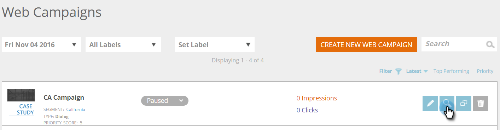

# Förhandsgranska och testa en webbkampanj {#preview-and-test-a-web-campaign}

I den här artikeln visas olika sätt att förhandsgranska en webbkampanj och även hur du testar den med ett sandlådesegment direkt på webbplatsen.

## Förhandsgranska en webbkampanj på sidan Skapa {#preview-a-web-campaign-on-the-creation-page}

1. Gå till **Webben** **Kampanjer**.

   

1. Klicka på** Skapa ny webbkampanj**** **eller ikonen för att redigera en befintlig kampanj.

   

1. Lägg till sidans URL i Förhandsgranska på plats och klicka på **Förhandsgranska**. Ett nytt fönster/en ny flik öppnas som visar kampanjens förhandsgranskning.

   

   >[!TIP]
   >
   >Klicka på **Dela** för att öppna ett e-postmeddelande med en fast URL för kampanjens förhandsgranskning.

   >[!NOTE]
   >
   >Du kan också installera ett webbläsarplugin-program (antingen [Chrome](https://chrome.google.com/webstore/detail/marketo-web-personalizati/ldiddonjplchallbngbccbfdfeldohkj) eller [Firefox](http://docs.marketo.com/display/docs/assets/mwp-0.0.0.8.xpi)) för att få den bästa upplevelsen när du förhandsgranskar kampanjen. Se avsnittet nedan.

## Förhandsgranska en webbkampanj på sidan Skapa med plugin-programmet för webbläsare {#preview-a-web-campaign-on-the-creation-page-using-the-browser-plug-in}

1. Följ steg 1 och 2 från `section above`.
1. Klicka på länken till webbläsarplugin-programmet (i det här fallet använder vi Chrome).

   

1. Ett nytt fönster/en ny flik öppnas. Klicka på **Lägg till i Chrome**.

   

1. Klicka på **Lägg till tillägg**.

   

1. Gå tillbaka till Marketo. Lägg till sidans URL och klicka på **Förhandsgranska**.

   

1. Ett nytt fönster/flik öppnas där du kan förhandsgranska hur kampanjen ser ut på en dator, telefon eller surfplatta.

   

## Förhandsgranska en webbkampanj på webbkampanjsidan {#preview-a-web-campaign-on-the-web-campaigns-page}

1. När du tittar på listan över dina webbkampanjer väljer du bara en kampanj och klickar på ikonen **Förhandsgranska**.

   

   Enkelt!

## Förhandsgranska en webbkampanj på din webbplats {#preview-a-web-campaign-on-your-website}

Skapa ett sandlådesegment och en kampanj.

1. Gå till **Segment**.

   

1. Klicka på **Skapa ny**.

   

1. Namnge segmentet.
1. Under Beteende drar du Inkludera sidor till arbetsytan. Lägg till värdet *sandbox=1*. Klicka på Spara och definiera kampanj.

   

1. På sidan Ange webbkampanj ändrar du målsegmentet till sandlådesegmentet genom att markera det i listan.

   

1. Slutför kampanjkreativiteten och klicka på **Starta**.\
   

1. Gå till webbplatsen och lägg till URL-parametern&quot;?sandbox=1&quot; i slutet av URL:en. Exempel: [www.marketo.com?sandbox=1](http://www.marketo.com/?sandbox=1)
1. Se kampanjens respons på er webbplats.

>[!NOTE]
>
>Kampanjerna reagerar bara en gång under en besökarsession. Rensa dina cookies i webbläsaren om du vill se kampanjen igen.

>[!NOTE]
>
>Omdirigeringskampanjer kan inte förhandsgranskas. Det enda sättet att testa dem är att använda ett sandlådesegment (som har specifika sidor som mål - *sandbox=redirect*)

