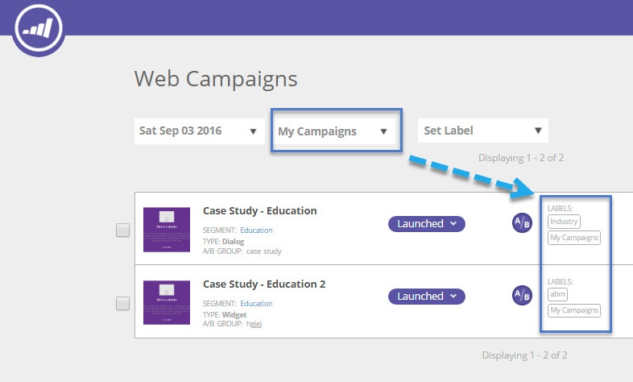

# Visa webbkampanjer från en viss etikett {#view-web-campaigns-from-a-specific-label}

Vill du visa och filtrera kampanjer efter en viss etikett?

## Filtrera efter befintliga etiketter {#filter-by-existing-labels}

1. Gå till **Webbkampanjer** **för** webben.

   

1. Välj önskad etikett i listrutan Etiketter.

   

1. Observera nu att vi bara visar de kampanjer som är kopplade till den valda etiketten?

   

>[!MORELIKETHIS]
>
>* [Märka webbkampanjer](label-your-web-campaigns.md)
>* [Visa segment från en viss etikett](../../../product-docs/web-personalization/using-web-segments/view-segments-from-a-specific-label.md)
>* [Märk upp dina segment](../../../product-docs/web-personalization/using-web-segments/label-your-segment.md)

>

