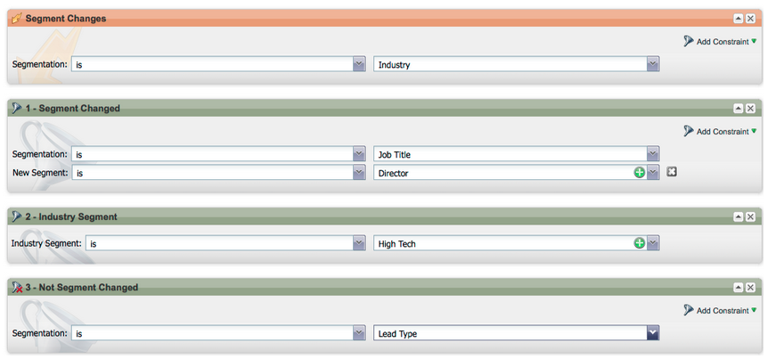
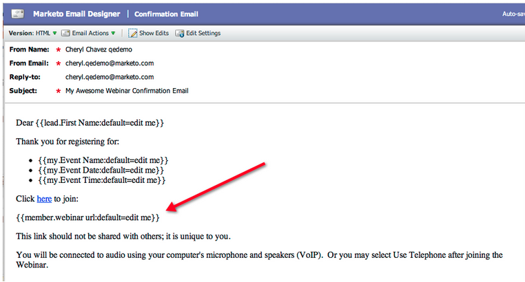

# Versionsinformation: April 2012 {#release-notes-april}

## Segmenteringsfilter och utlösare {#segmentation-filters-and-triggers}

>[!NOTE]
>
>**Djupdykning**
>
>Andra releaser finns i [versionsinformationen](http://docs.marketo.com/display/docs/release+notes) .

Målgruppsanpassar ni samma grupp av leads konsekvent? Om så är fallet, använd segmentering i era smarta listor för riktade leads. Med segmentering segmenteras hela din lead-databas alltid och kan återanvändas i alla program för att vara konsekvent. Segmenteringsresultaten hämtas snabbt eftersom de inte kräver att den smarta listan ska köras när begäran görs.

## Infoga externa värden i e-postinnehåll och andra flödessteg via utökade API-funktioner {#insert-external-values-into-email-content-and-other-flow-steps-through-expanded-api-capabilities}

* Med API:t för begärandekampanjen kan du nu skicka in värden för Mina token för just den körningen av kampanjen - detta är särskilt användbart för att fylla i e-postinnehåll via API:t
* Nya API:er för Upload To List och Schedule Campaign har stöd för ovanstående för listor med leads och batchkampanjer.

## Enklare bekräftelsemeddelanden för GoToWebinar och WebEx (Adobe Connect och ON24 kommer snart!) {#easier-confirmation-emails-for-gotowebinar-and-webex-adobe-connect-and-on-coming-soon}

Vi har förenklat bekräftelse-URL:en genom att skapa en medlemstoken som visar den unika URL:en för registreringsbekräftelse för varje lead. Du behöver inte längre skapa den här URL:en med olika variabler. Detta är för närvarande tillgängligt för GoToWebinar- och WebEx-kunder, och kommer att finnas för Adobe Connect och ON24 i nästa version.

## Ladda upp flera bilder och filer med ett klick! {#upload-multiple-images-and-files-with-a-single-click}

Spara tid och bli effektivare när du importerar bilder och filer till Marketo! Om du använder Firefox eller Google Chrome kan du markera flera filer och överföra alla samtidigt. Även om det inte finns någon gräns för hur många filer du kan överföra är den enskilda storleksgränsen per fil 50 MB.

Obs! Den här funktionen stöds inte i Internet Explorer eftersom webbläsaren är begränsad.

## Flytta text i ett e-postmeddelande {#move-text-in-an-email}

Du kan ordna om textblock i ett e-postmeddelande. Markera ett textblock i textredigeraren, När du klickar på redigeringsikonen visas alternativet att flytta blocket uppåt eller nedåt.

## Salesforce-referenser borttagna för icke-Salesforce-användare {#salesforce-references-removed-for-non-salesforce-users}

Om du inte synkroniserar din prenumeration med Salesforce kommer du att märka att alla mappar och flödesåtgärder som refererar till Salesforce tas bort.

## Marketo Revenue Cycle Analytics {#marketo-revenue-cycle-analytics}

**Förbättrade Gate-stadier i intäktscykelmodelleraren**

Tillåter användare att definiera en ordning för sina övergångsregler.

