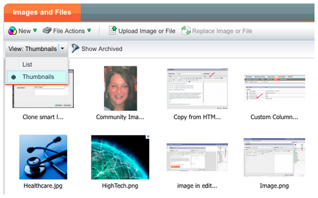

# Versionsinformation: Juni 2012 {#release-notes-june}

>[!NOTE]
>
>**Djupdykning**
>
>Andra versioner finns i [versionsinformationen](http://docs.marketo.com/display/docs/release+notes) djupdykning.

## Marketo Lead Management Förbättringar {#marketo-lead-management-enhancements}

### Byt namn på {#rename}

Du kan byta namn på smarta listor, statiska listor och kampanjer. Om du använder dessa resurser i filter, utlösare eller flöden uppdateras även namnet automatiskt där. Du har alltid kunnat byta namn på dina e-postmeddelanden, formulär och mappar.

Och som bonus förbättrade vi arbetet med att ange och visa beskrivningstext för resurser.

## Importera fältmappning {#import-field-mapping}

Vi har gjort det mycket enklare att importera en lista till Marketo! Under importprocessen kan du mappa namnet på Marketo-fältet till kolumnrubriknamnet i importfilen. I Admin kan du dessutom konfigurera aliasnamn som mappas till fältnamnet i Marketo, så att användarna alltid väljer rätt fält.

När du fortsätter att importera och mappa fält kommer Marketo att komma ihåg och visa mappningarna under importen för att underlätta användningen. Och för att göra livet ännu enklare kan du klicka på rubriken Exempelvärde för att se de olika värden som skulle fylla i fältet. Detta hjälper dig att mappa rätt fält varje gång!

## Sammanfattningssida för smarta listor och statiska listor {#summary-page-for-smart-lists-and-static-lists}

Har du någonsin undrat var listorna används? Eller vem skapade listan eller senast ändrade den? Den nya sammanfattningssidan som finns på smarta listor och statiska listor innehåller dessa viktiga detaljer.

På de befintliga sammanfattningssidorna för program och kampanj har vi även lagt till informationen Skapad den/Användare och Senast ändrad den/Användare!

## Används av för resurser {#used-by-for-assets}

Vi har lagt till en ny flik i resurssammanfattningssidorna, som anropas av!

Exempel: Används av för statiska listor

## Stödlinjer för landningssida {#landing-page-gridlines}

Med stödlinjerna för landningssidor blir det mycket enklare att justera text, grafik och formulär på landningssidan. Slå på och av den för en viss landningssida och justera även bredden mellan linjerna!

## Leads som blockerats från e-postmeddelanden {#leads-blocked-from-mailings}

När du schemalägger en kampanj kan du klicka på länken för att se en lista över leads som har blockerats från ditt utskick.

## Vänta steg - Leadtoken och Min token {#wait-step-lead-token-and-my-token}

I majversionen har vi lagt till avancerade alternativ för steget Vänta. Med dessa ändringar kan du ange en arbetsdag, ett datum och en tid. I den här versionen har vi lagt till möjligheten att använda en token i väntesteget. Du kan till exempel använda `{{lead.Birthday}}` för att skicka ett e-postmeddelande på födelsedagen, eller använda `{{my.Event Date}}` för att skicka en slutgiltig påminnelse för webbinariet.

## Visa som miniatyrbilder i Design Studio {#view-as-thumbnails-in-design-studio}

Byt vy från en lista med bilder till en miniatyrbildsvy!

Obs! Från och med den här versionen kommer den tidigare sorteringen i stödraster för smarta listor inte att gälla för nästa smarta lista som du visar. Om du t.ex. sorterar en smart lista efter företagsnamn sorteras inte nästa smarta lista som visas i det här fältet automatiskt.

Påminnelse: Uppgradering av e-postprestandarapport pågår!

## Förbättringar i Marketo Revenue Cycle Analytics {#marketo-revenue-cycle-analytics-enhancements}

### Nya mått i analys av affärsmöjlighet {#new-metrics-in-program-opportunity-analysis}

Ni kan nu få insikter om det genomsnittliga antalet marknadsföringsåtgärder innan ni skapar eller stänger nya möjligheter, samt om det genomsnittliga värdet av en marknadsföringskontakt.

## Visar multidiagram {#displaying-multi-charts}

Med funktionen för flera diagram kan du visa flera diagram i en enda rapport om intäktscykler i Explorer. Du kan till exempel använda den här funktionen när du vill visa samma data för olika månader. Den här funktionen förhindrar också att du behöver skapa separata filter och rapporter.

## Diagramtyp för varmt stödraster {#heat-grid-chart-type}

Värmestödraster gör det möjligt att visualisera data så att ni kan identifiera mönster för marknadsföringens resultat. Den här visualiseringstypen färgkodar dina resultat så att du kan visa komplexa affärsanalyser i en lättbegriplig visualisering.

## Punktdiagramtyp {#scatter-chart-type}

Punktdiagram hjälper dig att visualisera data i flera dimensioner i ett diagram. Den här visualiseringstypen ritar en bubbla i ett diagram baserat på de attribut som används. Du kan sedan använda ett mått för att färgkoda bubblan och/eller använda ett mått för att ange bubblans storlek.

