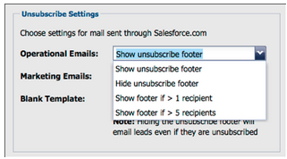

# Versionsinformation: Maj 2012 {#release-notes-may}

>[!NOTE]
>
>**Djupdykning**
>
>Andra releaser finns i [versionsinformationen](http://docs.marketo.com/display/docs/release+notes) .

## E-postprestandarapport - omdesign {#email-performance-report-redesign}

Obs! detta kommer att bli en stegvis utrullning, som börjar med majversionen

Vi har gjort så att e-postprestandarapporter för e-postmarknadsföring och Campaign körs snabbare. Vi har också förbättrat definitionerna av vissa mätvärden och konsoliderat värdena&quot;Skickat&quot; och&quot;Skickat lead&quot; till ett enda mätvärde,&quot;Skickat&quot;. Vi har slagit samman&quot;Levererade meddelanden&quot; och&quot;Levererade leads&quot; till&quot;Levererat&quot;.

## Förbättringar av vänteläge {#wait-step-enhancements}

Med de nya avancerade väntningsegenskaperna kan du konfigurera väntesteget i en smart kampanjflödesåtgärd så att du&quot;väntar till&quot; en viss veckodag, nästa arbetsdag, ett visst datum eller en viss tid. Förbättringarna ser till att dina e-postmeddelanden från vårdhem kommer in i Inkorgen under kontorstid!

Figur 1. Ange väntesteget som ska avslutas en arbetsdag

## Dolda arkiverade resurser {#archived-assets-hidden}

Arkiverade resurser filtreras automatiskt från automatiska förslag, listrutor och rapporter, vilket gör det enklare att hitta det du letar efter!

Figur 2. Exempel på det arkiverade e-postfiltret

## Ny incheckningsapp för händelser för iPad {#new-event-check-in-app-for-ipad}

Förenkla incheckningen av event med vår nya iPad-app! Appen Event Check-in synkroniseras med Marketo Program så att du enkelt kan söka efter deltagare i en händelse och lägga till nya leads direkt.

Kräver iOS 5.1 eller senare. Endast iPad.

Figur 3. Hemsida för incheckning av händelser

Figur 4. Incheckning av händelse: Välj en händelse!

Figur 5. Checka in dem

## Bekräftelse-URL för utökat webbinarium {#enhanced-webinar-confirmation-url}

Finns nu för ON24 och Adobe Connect! Inkludera en unik länk i bekräftelsemeddelandet för varje registrerad deltagare med den nya `{{member.webinar URL}}` token. Bland Adobe Connect förbättringar finns även möjligheten att aktivera/inaktivera e-postmeddelandet med kontoinformation för Adobe som innehåller användarens inloggnings-ID och lösenord.

Figur 6. Få personer att komma till ert webbinarium

## Förhandsgranska mall {#template-preview}

Söker du en viss mall när du skapar e-post eller landningssida, men vet inte hur den ser ut? Med den nya funktionen för förhandsgranskning av mallar kan du verifiera den valda mallen innan du sparar en ny resurs!

Figur 7. Förhandsgranska den valda mallen

## Konfigurerbar förifyllning av formulär {#configurable-form-prefill}

Kontrollera förifyllning av formulärdata på prenumerationsnivå och skriv över på landningssidnivå. Utan förifyllning kan du se till att leadet ger den senaste informationen.

Figur 8. Konfiguration av förifyllnad av formulär i Admin

Bild 9. Redigera inställning för formulärifyllning på en landningssida

## Marketo Treasure Chest {#marketo-treasure-chest}

Få tillgång till experimentella funktioner som utvecklats av Marketo-tekniker för att förbättra användarupplevelsen. Den här versionen innehåller Ångra-funktionen för e-post, plus möjligheten att ange kommentarer och samarbeta med andra användare på dina landningssidor.

\

Bild 10. Hanterarens börskursfunktioner i Admin

## Microsoft Dynamics® CRM-integrering {#microsoft-dynamics-crm-integration}

Synkronisera konton, kontakter och leads mellan Marketo och Microsoft Dynamics CRM Online med vår nya färdiga integrering!

Figur 11. Microsoft Dynamics-konfiguration

## Marketo Sales Insight Enhancements {#marketo-sales-insight-enhancements}

**Avsluta sidfotsalternativ**

Konfigurera när och om sidfoten för att avbryta prenumerationen visas för e-postmeddelanden som skickas via Sales Insight.

Figur 12. Inställningar för försäljningsinsikter i administratör

## Mappar för e-postmallar för försäljning {#folders-for-sales-email-templates}

Nu kan du ordna e-postmallarna som delas med Marketo Sales Insight i angivna mappar, vilket gör det enklare för säljarna att hitta rätt e-post.

Figur 13. Välj en mapp för dina e-postmeddelanden

## Få åtkomst till säljprojektsanalys från säljinsikter {#access-opportunity-analyzer-from-sales-insight}

Ge säljarna insikt i vilka marknadsföringsaktiviteter som skapar engagemang med hjälp av direktåtkomst till säljprojektsanalysen från Marketo Sales Insight. Obs! Kräver licens för intäktscykelanalys.

## Anpassat fält för kontaktstatus {#custom-field-for-contact-status}

Du kan nu mappa ett anpassat fält i Salesforce för att fylla i statusfältet för kontakter i Mina bästa val, Mitt teams bästa val och anpassade vyer.

Figur 14. Mappa ett anpassat fält till Kontakter

Se sidor som besökts av anonyma leads

Gå ned till de sidor som visas av ett anonymt lead från den anonyma webbaktivitetsvyn.

Figur 15. Se anonym webbaktivitet

## Förbättrat lead- och kontaktabonnemang {#enhanced-lead-and-contact-subscribe}

Följ en lead eller kontakta när som helst med den nya prenumerationsknappen på postinformationssidan.

