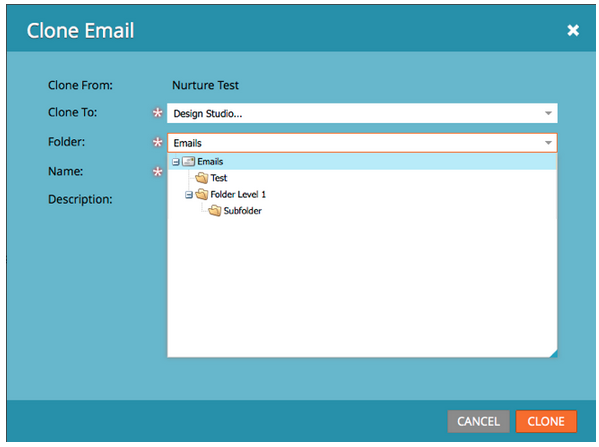

# Versionsinformation: Juni 2013 {#release-notes-june}

Följande funktioner finns i juniversionen. Kontrollera om det finns funktioner i din [Marketo Edition](http://docs.marketo.com/display/docs/assets/pricing.php) .

Efter releasen ska du kontrollera fliken [Ny release](release-notes-december-2013.md) i communityn för detaljerade kunskapsbasartiklar för varje funktion!

## Ytterligare användarspråk {#additional-user-languages}

Se gränssnittet Marketo Lead Management på ditt språk - som nu stöder spanska och portugisiska.

## Cobalt-användargränssnitt {#cobalt-user-interface}

Under de närmaste månaderna kommer du att märka ett nytt tema som lanserats i olika delar av programmet; till exempel påverka modala fönster.

## Kloning av undermapp {#subfolder-cloning}

Klona resurser i undermappar.

## Flera modeller {#multiple-models}

Den här funktionen är en bra idé för RCA (Revenue Cycle Analytics) i communityn och gör att du kan skapa flera modeller för att få en mer detaljerad bild av intäktstratten per produktlinje, affärsenhet eller region. Rapporterna Leads by Revenue Stage, Success Path Analyzer, Program Analyzer och Revenue Explorer har nu stöd för möjligheten att välja en specifik modell för rapportering.

Som standard finns det två modeller för Select SMB Edition och femton för Enterprise Edition. Du kan också köpa ytterligare modeller.

