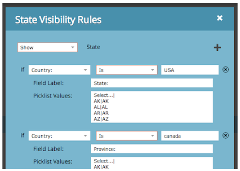

# Versionsinformation: Februari 2014 {#release-notes-february}

Följande funktioner ingår i februari 2014-versionen. Kontrollera om din Marketo Edition innehåller funktioner. Kom tillbaka efter releasen och hitta länkar till detaljerade kunskapsbasartiklar för varje funktion!

## Villkor för deltagande som vinnande {#engagement-score-as-winning-criteria}

[Använd poängen](../../product-docs/email-marketing/email-programs/email-program-actions/email-test-a-b-test/define-the-a-b-test-winner-criteria.md) för engagemang för att fastställa vinnande variant i A/B-delningsprovet eller Champion/Challenger-testet. Testet måste köras i minst 24 timmar för att ge ett lämpligt engagemangsmoment.

## Fliken Resultat av e-postprogram {#email-program-results-tab}

[Visa resultat](../../product-docs/email-marketing/email-programs/email-program-data/view-email-program-results.md) och aktiviteter som loggats för e-postprogrammet.

## Personer/leads blockerade från e-post {#people-leads-blocked-from-mailing}

[Klicka på de personer/leads som blockerats från att skicka](../../product-docs/email-marketing/email-programs/managing-people-in-email-programs/define-an-audience-with-a-smart-list.md) e-postnummer för att se vilka som inte får e-postmeddelandet på grund av att de är avbrutna, svarta listade, har en ogiltig eller tom e-postadress eller att marknadsföringen är inaktiverad.

## Exportera e-postprogramdata {#export-email-program-data}

[Exportera e-poststatistik till Excel](../../product-docs/email-marketing/email-programs/email-program-data/export-email-program-dashboard-to-excel.md), inklusive AB Test-variantdata.

## Resultatrapport om engagemang i engagemangsströmmen {#engagement-score-in-engagement-stream-performance-report}

Vi lade till engagemangsresultatet i [resultatrapporten](../../product-docs/email-marketing/drip-nurturing/reports-and-notifications/engagement-stream-performance-report.md) för interaktionsströmmen för att hjälpa er att se hur effektivt innehållet i engagemangsprogrammet är.

## Programinformation i e-postanalys {#program-details-in-email-analysis}

[Nu kan du gruppera dina e-postmått efter Programnamn, Kanal och Taggar](../../product-docs/reporting/revenue-cycle-analytics/email-analysis/build-an-email-analysis-report-that-shows-program-information.md). Programnamnet läggs till i fältet E-postnamn när e-postmeddelandet är en lokal resurs i programmet. Det nya fältet Programnamn visar programnamnet för den smarta kampanj som skickade e-postmeddelandet. Detta kan skilja sig från programmet i fältet E-postnamn om e-postadressen är en lokal resurs i ett annat program.

## Uppdatera till Klicka på länkfilter och utlösare {#update-to-clicks-link-filters-and-trigger}

Följande filter- och utlösarnamn har uppdaterats:

* Klicka på Länk till Klicka på Länk på webbsida
* Klicka på Länka till klickad länk på webbsida
* Inte klickad på Länk till länk som inte klickats på på webbsidan

## Forms 2.0-förbättringar {#forms-enhancements}

I den här versionen har vi gett Forms 2.0 flera&quot;livskvalitetsuppdateringar&quot;. Förutom att möjliggöra progressiv profilering av inbäddade formulär har vi gjort arbetsflödes- och användargränssnittsändringar som gör det enklare att använda den mer avancerade funktionen i redigeraren, [inklusive synlighetsregler](../../product-docs/demand-generation/forms/form-fields/dynamically-toggle-visibility-of-a-form-field.md), avancerade tacksidor och dolda fält.

