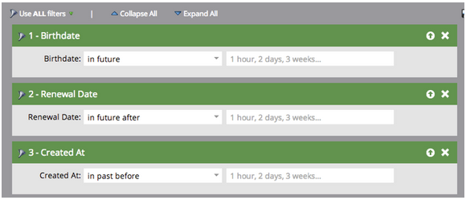

# Versionsinformation: Juli 2014 {#release-notes-july}

Följande funktioner ingår i juliversionen 2014. Kontrollera om din Marketo Edition innehåller funktioner. Efter releasen finns länkar till detaljerad funktionsdokumentation.

## Marknadsföringskalender {#marketing-calendar}

Se alla händelser, e-postmeddelanden med mera i alla program. [Den nya produkten](/help/marketo/product-docs/core-marketo-concepts/marketing-calendar/understanding-the-calendar/navigating-the-marketing-calendar.md) är kostnadsfri för kunder med 10 eller färre användare av Marketo Lead Management eller Dialog.

Dokumentation om marknadsföringskalendern kommer att finnas tillgänglig vid lanseringen.

## Nytt utseende och känsla {#new-look-and-feel}

Marketo Lead Management kommer att uppdateras med ett nytt utseende som är modernt och slimmat och som innehåller en uppdaterad navigeringsfunktion.

## Datumoperatorer {#date-operators}

[Avancerade filter](/help/marketo/product-docs/core-marketo-concepts/smart-lists-and-static-lists/creating-a-smart-list/smart-list-filter-operators-glossary.md) för&quot;tidigare&quot;,&quot;i framtiden&quot; och&quot;i framtiden efter&quot;. Du kan till exempel hitta leads som har ett födelsedatum inom de kommande tre månaderna eller ett kontrakt som upphör efter sex månader.

## Programplaneringsvy {#program-schedule-view}

Förutom den marknadsföringskalender du hanterar dina evenemang och standardprogram med finns det en ny schemavy direkt i programmet.

* Schemalägg om alla datum samtidigt
* Nya Tentative Dates - penna in det!
* Anpassade anmälningstyper - Att göra, Tryck på Frigör, vad du vill

## Lista åtgärder i ReST API {#list-operations-in-the-rest-api}

Vi har lagt till anropen nedan som rör liståtgärder i ReST. Den fullständiga dokumentationen finns på [developers.marketo.com](http://developers.marketo.com/documentation/rest/) .

* Hämta lista efter ID
* Hämta flera listor
* Importera till lista
* Hämta status för import till lista

## Snabb listimport {#fast-list-import}

Över **50 gånger snabbare** zoomas filerna in i Marketo! De gamla importalternativen &quot;Normal&quot; och &quot;Optimerad för nya leads&quot; har ersatts med &quot;Standard (snabb import)&quot;.

Alternativet Hoppa över nya leads och uppdateringar ändras inte.

## Nya förbättrade Munchkin! {#new-improved-munchkin}

Utbyggnaden kommer att stagnera från mitten av juli och fortsätta under de kommande månaderna.

* Tar bort beroendet jQuery för fullständig och framtida kompatibilitet
* Mer kompatibel med andra JavaScript-skript på webbplatsen
* Helt testad på många sajter under det senaste året!

## RTP: Kampanjmallar för personalisering i realtid {#rtp-real-time-personalization-campaign-templates}

RTP Set Campaign-sidan [innehåller nu färdiga mallar](/help/marketo/product-docs/web-personalization/using-templates/using-templates-to-create-web-campaigns.md). Välj bland en mängd olika stilar, bland annat webbinarier, fallstudier och e-böcker.

## RTP: Förbättringar i JavaScript API {#rtp-javascript-api-enhancements}

Nytt RTP API-anrop för att få besöksdata i realtid, som organisation, bransch, plats och segmentkodsmatchning. Om du håller markören över ett segmentnamn på segmentsidan visas dessutom ett verktygstips som visar segmentkoden. Se vår [utvecklarwebbplats](http://developers.marketo.com/documentation/websites/rtp-js-api/) för fullständig dokumentation.

## RTP: HTML5-stöd i Campaign Content Editor {#rtp-html-support-in-campaign-content-editor}

Innehållets WYSIWYG-redigerare på sidan Ange kampanjer har nu full HTML5-kompatibilitet. Klicka på&quot;HTML&quot;-ikonen i redigeraren för att infoga HTML5-kod.
