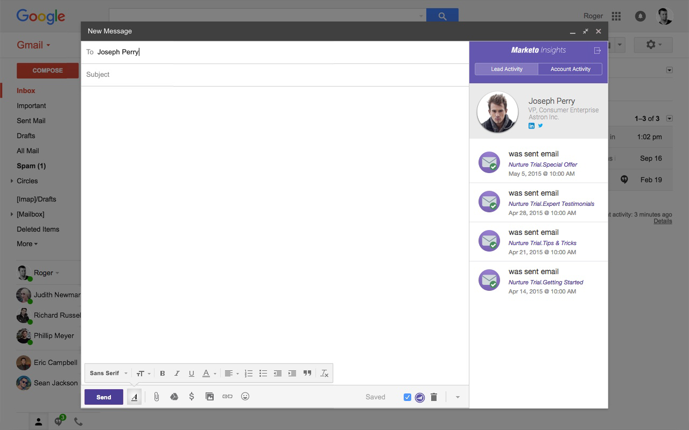

# Versionsinformation: Hösten 2015 {#release-notes-fall}

Följande funktioner finns i höstutgåvan 15. Kontrollera om din Marketo Edition innehåller funktioner.

## Prenumerera på en smart lista {#subscribe-to-a-smart-list}

[Prenumerera på en smart lista](../../product-docs/reporting/basic-reporting/report-subscriptions/subscribe-to-a-smart-list.md)

Genom att prenumerera på Smart List kan marknadsförare exportera en smart lista och skicka den med e-post till intressenter som inte använder Marketo, till exempel försäljnings- eller telemarketingsteam.

Exporten kan schemaläggas varje dag, vecka eller månad och kan ha slutleveransdatum och kan anpassas så att ett begränsat antal kolumner delas.


Flera prenumerationer kan skapas i en smart lista. Det finns en begränsning på 100 prenumerationer med 100 000 leads per prenumeration, över arbetsytor, per Marketo-instans.


## Marketo-anpassade objekt {#marketo-custom-objects}

[Marketo-anpassade objekt](http://docs.marketo.com/display/docs/marketo+custom+objects)

Skapa enkelt anpassade objekt från administratörsgränssnittet. Vi stöder för närvarande möjligheten att skapa ett anpassat 1:N-objekt i Marketo och koppla det till en lead eller ett företag.

>[!NOTE]
>
>Marketo-anpassade objekt är inte tillgängliga för Spark.


## Marketo Insights för Google Chrome {#marketo-insights-for-google-chrome}

[Marketo Insights för Google Chrome](../../product-docs/marketo-sales-insight/msi-chrome-plugin/using-marketo-insights-for-google-chrome.md)

Vi är glada över att kunna meddela att en uppdatering av vårt Google Mail Sales Insight-tillägg har släppts! Visa den i [Chrome Store](https://nation.marketo.com/external-link.jspa?url=https://chrome.google.com/webstore/detail/marketo-insights-for-goog/jjkfbhajlmoeegbjgjipliamplidmbjb).

Den här uppdateringen innehåller många nya funktioner:

* Innan säljarna engagerar kan de se relevant information om sina prospects direkt i Google Mail, bland annat jobbtitlar, twitterprofiler, företagsinformation, foton med mera.
* Säljarna kan i realtid se vilket innehåll som presumtiva kunder interagerar med över olika kanaler, som e-post som öppnats eller klickats, online- eller personliga event som besökts, webbsidor som besökts, e-böcker som laddats ned och mycket annat.
* E-postmeddelanden som skickas via Google Mail loggas i Marketo och spåras i realtid. På så sätt kan säljarna se när potentiella kunder tittar på sina e-postmeddelanden så att de kan följa upp vid precis rätt tidpunkt. Marketo Sales Insight för Google Mail gör det också enkelt för säljarna att utnyttja mallar som skapats av marknadsföring för att skicka vackra inbjudningar, erbjudanden och andra typer av innehåll.



## Marketo Mobile Engagement - Tokens, Send Sample och Preview {#marketo-mobile-engagement-tokens-send-sample-preview}

* [Tokens](../../product-docs/mobile-marketing/push-notifications/configure-mobile-push-notification.md)
* [Skicka exempel](../../product-docs/mobile-marketing/push-notifications/send-a-push-notification-sample.md)
* [Förhandsgranska](../../product-docs/mobile-marketing/push-notifications/preview-a-push-notification.md)

Anpassa enkelt push-meddelanden med [tokens](https://docs.marketo.com/pages/viewpage.action?pageId=7512454).


Du kan också [förhandsgranska](../../product-docs/mobile-marketing/push-notifications/preview-a-push-notification.md) eller skicka ut ett [exempel](../../product-docs/mobile-marketing/push-notifications/send-a-push-notification-sample.md) på ett push-meddelande innan du distribuerar det till kunderna.


## Smarta kampanjer i några ögonblick {#smart-campaigns-in-moments}

[Smarta kampanjer i några ögonblick](../../product-docs/core-marketo-concepts/mobile-apps/marketo-moments/understanding-moments/understanding-smart-campaign-cards.md)

Statistik om e-postmeddelanden som skickas via smarta kampanjer är nu tillgängliga i ögonblicket. Andra funktioner i den här uppgraderingen är:

* Svep-till-Klar. Har du för många kort i strömmen? Nu kan du svepa bort dem!
* Skicka ett prov direkt från förhandsgranskningsskärmen
* Smart List-information har lagts till i e-postprogramkort
* Stöd för avbruten status för e-postprogram har lagts till


## RTP - Innehållsanalys och Recommendations {#rtp-content-analytics-and-recommendations}

[Content Analytics](../../product-docs/web-personalization/understanding-web-personalization/understanding-content-analytics.md) och Recommendations

RTP Content Analytics visar hur ert webbinnehåll fungerar genom regelbundna webbbesök och även besök som genererats av RTP:s rekommendationsmotor.

* Se vilket innehåll som fungerar bäst och ger de bästa leads
* Öka er innehållskonsumtion genom att göra det möjligt för RTP:s motor för prediktivt innehåll att automatiskt rekommendera det bästa innehållet till rätt besökare
* Detaljgranska varje innehållsresurs för mer djupgående mått, diagram och prestanda

RTP:s Assets-sida är nu uppdelad i Content Analytics och Content Recommendations.

* **Innehållsanalys:** Visar vyer och direkta leads för allt identifierat och definierat webbinnehåll, vilket hjälper dig att analysera ditt bästa innehåll
* **Recommendations** Content: Visar visningar och klickningar från RTP:s rekommenderade innehåll och tillhörande leadattribuering. Du kan också redigera och aktivera innehållsrekommendationer från den här sidan för [fältets](https://docs.marketo.com/display/DOCS/Enabling+the+Content+Recommendation+Engine) och [multimedias](https://docs.marketo.com/display/DOCS/Enabling+the+Rich+Media+Recommendation+Engine) rekommendationer.

* Alla direkta lead-data på dessa två sidor har uppdaterats retroaktivt sedan början av året (1 januari 2015).

## RTP - Klona en RTP-kampanj {#rtp-clone-an-rtp-campaign}

[RTP - Klona en RTP-kampanj](../../product-docs/web-personalization/working-with-web-campaigns/clone-a-web-campaign.md)

Kloning av en RTP-kampanj gör det snabbare och effektivare att skapa mer personaliserade webbkampanjer. Använd klonfunktionen på RTP:s kampanjsida för att kopiera kampanjinställningarna och ändra innehållet för optimering av delad testning, eller klona en kampanj med samma innehåll och rikta den mot ett annat segment. Skapa kampanjer på några sekunder!


## Förbättringar av textredigeraren {#rich-text-editor-improvements}

Vi gör flera förbättringar i textredigeraren. Efter att vi släppt den uppdaterade redigeraren i juli fick vi bra feedback och kunde bearbeta dessa ändringar i uppgraderingen. Det finns mycket mer att komma över de kommande månaderna. Här är en lista över nyheterna under det fjärde kvartalet:

* VML stöds nu i din HTML-kod:

   ```
   <v:background xmlns:v="urn:schemas-microsoft-com:vml" fill="t">
   ```

   ```
   <v:fill type="tile" src="<a href="http://i.imgur.com/YJOX1PC.png" rel="nofollow">http://i.imgur.com/YJOX1PC.png</a>" color="#7bceeb"/>
   ```

   ```
   </v:background>
   ```

* Vad som helst kan nu infogas i en giltig HTML-kommentar (vissa syntaxer som nedan har tagits bort tidigare):

   ```
   <!--[if gte mso 9]> 
   ```

   ```
   <![endif]-->
   ```

* Fyll inte ut tomma tabellceller med `**`

* Knappen Maximera/minimera som lagts till i HTML-källredigeraren
* Befintliga tabellegenskaper identifieras och visas nu i dialogrutan Tabellegenskaper
* Båda knappraderna visas nu som standard.
* Redigeraren godkänner nu alla element (även inaktuella eller icke-standardelement):

   ```
   <myCustomElement>Hello World!</myCustomElement>
   ```

* Redigeraren godkänner nu alla attribut (även inaktuella eller icke-standardattribut):

   ```
   <myCustomElement myCustomAttribute="foo">Hello World!</myCustomElement>
   ```

   ```
   <td background="someImage.png"> 
   ```

## Microsoft Dynamics - Verifiera synkronisering {#microsoft-dynamics-validate-sync}

[Microsoft Dynamics - Verifiera synkronisering](../../product-docs/crm-sync/microsoft-dynamics-sync/sync-setup/validate-microsoft-dynamics-sync.md)

Det här nya administrationsverktyget kör en serie kontroller för att se om dina synkroniseringskonfigurationer har konfigurerats korrekt.


## Lägg till fält i CRM-objektsynkronisering {#add-fields-to-crm-custom-object-sync}

Lägg enkelt till nya fält i anpassade objekt som synkroniserats från Salesforce och Dynamics. Nu kan du lägga till nya fält i din anpassade objektsynkronisering utan att inaktivera och aktivera hela det anpassade objektet.

## Ändringar av säkerhetsfunktioner {#changes-to-security-features}

* Lösenordsförsök är begränsade till 5. Efter det femte försöket kommer användaren att låsas.
* Tidsgränsen för den inaktiva sessionen kan nu konfigureras för prenumerationen.


## Stöd för IE 11 (och stöd för IE 9 tas bort) {#ie-support-and-deprecating-support-for-ie}

Nu har vi officiellt stöd för webbläsaren Microsoft Internet Explorer 11 och håller på att ta bort stöd för webbläsaren Microsoft Internet Explorer 9.

## Lightning UI-stöd för MSI {#lightning-ui-support-for-msi}

Det senaste MSI-paketet för apputbyte fungerar med både Lightning- och äldre versioner av Salesforce-gränssnittet.

## Nytt Dynamics-plugin {#new-dynamics-plug-in}

Det nya plugin-programmet kör olika åtgärder i asynkront läge för att öka prestandan.

## Sök på URL för landningssida i Design Studio {#search-by-url-of-landing-page-in-design-studio}

I sidstödrastret Design Studio Landing kan du nu söka efter landningssidor via sid-URL:en. Detta kan också exporteras.
