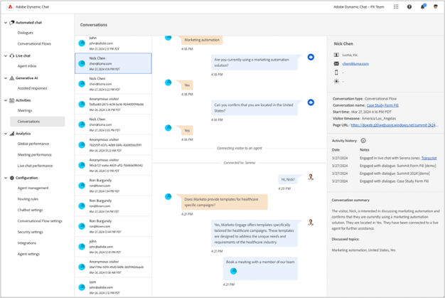

# Dynamic Chat versionsinformation {#dynamic-chat-release}

Adobe Dynamic Chat-releaser fungerar enligt en kontinuerlig leveransmodell som ger en mer skalbar metod för driftsättning av funktioner. Ibland finns det flera releaser på en månad, så var vänlig och kika regelbundet efter den senaste informationen.

Standardsidan för versionsinformation för Marketo Engage [finns här](/help/marketo/release-notes/current.md){target="_blank"}.

## Version från augusti 2024 {#august-release}

**Releasedatum: 23 augusti 2024**

### Anpassa format för konversationsmeddelanden {#custom-format-conversation-messages}

Strömdesigners har nu stöd för [infogning av HTML](/help/marketo/product-docs/demand-generation/dynamic-chat/automated-chat/stream-designer.md#create-a-stream){target="_blank"} för att anpassa konversationernas utseende och känsla.

### Chatbot rullar längst ned {#chatbot-scroll-to-bottom}

En ikon har lagts till i chattbot så att webbbesökare kan gå direkt till det sista meddelandet. Detta hjälper besökare att bläddra igenom texten för att snabbt komma tillbaka till konversationen.

### Meddelanden om kärnpuls {#core-pulse-notifications}

Användarna får nu ett [e-postmeddelande](/help/marketo/product-docs/demand-generation/dynamic-chat/live-chat/live-chat-overview.md#failed-action-notifications){target="_blank"} när en mötesbokning eller live-chatt misslyckas.

### Stöd för flera samtal {#support-for-multiple-conversations}

Chatbot stöder nu flera konversationer. Besökare på webbplatser kan engagera sig i olika konversationer på olika sidor samtidigt, med möjlighet att växla mellan dem.

### Standardsortering av innehåll {#default-sorting-for-content}

Som standard sorteras dina konversationsloggar, obesvarade frågor och frågagenereringstabeller efter skapandedatum (från senaste till äldsta).

### Leadupplösning i realtid {#real-time-lead-resolution}

Under en konversation med ett anonymt lead och ett e-post-ID anges, löser vi om det finns en känd lead-post med det e-post-ID:t och använder posten för personalisering i realtid. Om vi hittar flera poster sammanfogar vi dem i realtid. Detta beteende implementeras för både dialogrutor och konversationsflöden.

### Synkronisera leads utan cookies från Marketo Engage {#syncing-leads-without-cookies}

Tidigare synkroniserades endast kända leads med ett eller flera cookie-ID från Marketo Engage när Marketo Engage-synkroniseringen aktiverades. Alla kända leads (cookie-ID finns eller inte) synkroniseras nu till Dynamic Chat och kan användas för personalisering av konversationer.

### Skicka ytterligare besöksdata till konversationsflöden {#pass-additional-visitor-data}

Om du hämtar besöksinformation via andra kanaler, som formulär eller inloggning, kan du nu skicka informationen direkt till Dynamic Chat.

### Uppdaterade härledda data {#refreshed-inferred-data}

De flesta samtal på en webbplats pågår med anonyma besökare. Du kan fortfarande rikta in dem på slutna data, som är beroende av besökarnas IP-adresser. Vi har uppdaterat vår databas över IP-adresser och härledda data som nu stöder fyra gånger fler IP-adresser.

### Ljud har lagts till i agentwebbläsarmeddelanden {#sound-added-to-agent-browser-notification}

När en live-chatt tilldelas till en agent får de ett webbläsarmeddelande. Men ibland ser de inte dem. Vi har lagt till ett meddelandeljud för att förhindra att missade meddelanden går framåt.

### Möjlighet att uppdatera lead-profilen under live-chatt {#update-lead-profile-during-live-chat}

Under en live-chatt vill agenter samla in information om besökaren och uppdatera respektive profil. Det finns nu ett alternativ för att uppdatera attributvärden för lead- och företagsobjekt.

## Version från juni 2024 {#june-release}

**Releasedatum: 6 juni 2024**

### Konversationsflödeskort {#conversational-flow-card}

Effektivisera flera steg i ett flöde i dialogrutorna genom att utnyttja Conversational Flow-kortet.

Exempel: Om ditt mål är att skapa registreringar för ditt webbinarium via flera dialogrutor måste du återskapa samma flöde för alla dialogrutor som har det målet. Och om du måste uppdatera någon detalj måste du redigera varje dialogruta en åt gången. Det är inte längre fallet, tack vare konversationsflödet.

Förutom att återanvända flöden mellan flera dialogrutor kan du även använda samma övergångsflöde för att utlösa via andra kanaler, som formulär och landningssidor.

### Användningsgränser {#usage-limits}

På sidan Användningsbegränsningar visas viktig information, t.ex. paketinformation och status för din användningsgräns.

## Version från maj 2024 {#may-release}

**Releasedatum: 15 maj 2024**

### Förgodkänt svarsbibliotek {#pre-approved-response-library}

[Skapa ett marknadsföringsgodkänt bibliotek](/help/marketo/product-docs/demand-generation/dynamic-chat/generative-ai/response-library.md){target="_blank"} med AI-genererade frågor och svar som hjälper dig att konfigurera generativ AI-chatt på några minuter.

### Obesvarade frågor {#unanswered-questions}

[Använd en databas med obesvarade frågor](/help/marketo/product-docs/demand-generation/dynamic-chat/generative-ai/unanswered-questions.md){target="_blank"} från tidigare konversationer för att generera nya förgodkända svar och underhålla ett svarsbibliotek med den senaste informationen.

### Sammandrag {#conversation-summaries}

[Ge säljarna sammanfattade konversationer](/help/marketo/product-docs/demand-generation/dynamic-chat/live-chat/agent-inbox.md#conversation-summary){target="_blank"} med insikter om viktiga diskussionsämnen före möten för att minska förberedelsetiden och ge säljarna bättre information.

### GenAI-säljgenvägar {#genai-sales-shortcuts}

[Ge chattagenter snabbare sätt](/help/marketo/product-docs/demand-generation/dynamic-chat/live-chat/agent-inbox.md#shortcuts){target="_blank"} att komma åt AI-genererade svar, redigera befintliga genererade svar och söka efter ytterligare innehåll att skicka till köpare under konversation.

### Konversationsassistenten {#conversation-assist}

Hjälp säljarna att svara korrekt under live-samtal med svar som förgodkänts av ert marknadsföringsteam.

### Konversationsövningar {#conversation-nudges}

Knuffa webbbesökarna med en uppmaning att agera för att få konversationer att sluta.

## Version från april 2024 {#april-release}

**Releasedatum: 23 april 2024**

### Konversationsflöden är nu tillgängliga för alla användare {#conversational-flows-available-to-all-users}

Gör formulären och landningssidorna mer konvergerande och korta ned säljprocessen genom att tillåta kvalificerade leads att boka ett möte eller chatta med försäljningen direkt efter att ett formulär har skickats in med Conversational Forms, nu helt tillgängligt&#42; för alla Dynamic Chat-användare.

_&#42;Tidigare tillgänglig som utvärderingsfunktion med 100 livstidsåtaganden. Konversationsflödesåtaganden räknas nu mot månadsgränsen på 250 aktiverade konversationer för användare i Select-paketet._

### Återanropsfunktioner {#callback-functions}

[Med återanropsfunktionerna](/help/marketo/product-docs/demand-generation/dynamic-chat/setup-and-configuration/callback-functions.md){target="_blank"} kan du samla in Dynamic Chat analyshändelser i externa system, som Adobe Analytics eller Google Analytics, när besökarna interagerar med Dynamic Chat-konversationer. Du aktiverar analyshändelser för Dynamic Chat genom att registrera ett återanrop med API:t för att lyssna på händelserna. På så sätt kan ni få en mer holistisk bild av Dynamic Chat engagemang när det gäller andra nyckeldata, till exempel webbtrafik.

### Tillgänglighetsvillkor för Live-agent har lagts till i villkorlig förgrening {#live-agent-availability-conditional-branching}

Förutom inbyggda och anpassade Marketo Engage-fält kan du nu använda villkorlig förgreningslogik för att skapa förgreningar baserat på agentens tillgänglighet. Det här är användbart om du bara vill ge besökarna möjlighet att tala med en handläggare när det finns aktiva agenter tillgängliga.

### Villkoret Smart lista har lagts till i villkorlig förgrening {#smart-list-condition}

Med det nya villkoret Marketo Engage Smart List i villkorlig förgreningslogik kan du skapa förgreningar baserat på befintliga målgrupper som du redan har skapat i Marketo Engage i stället för att definiera villkoren för förgreningslogik i Dynamic Chat.

### Villkorliga förgreningar för konversationsflöden {#conditional-branching-for-conversational-flows}

Vi lanserade villkorliga förgreningar för dialogrutor tidigare i år, och nu kan du även utnyttja villkorliga förgreningar i konversationsflöden! Med villkorlig förgreningslogik kan du skapa förgreningar i ditt flöde baserat på olika villkor.

### Live-chatt för konversationsflöden {#live-chat-for-conversational-flows}

Vi lanserade chattfunktioner för dialogrutor 2023, och nu kan du även lägga till live-chattengagemang i dina konversationsflöden. Om du använder konversationsflöden med dina Marketo Engage-formulär kan du nu tillåta kvalificerade besökare att chatta med en handläggare direkt efter att formuläret har skickats in!

### Nyligen använda Marketo Engage-aktiviteter i agentinkorgen {#recent-marketo-engage-activities-in-agent-inbox}

Vi har lagt till nyligen utförda Marketo Engage-aktiviteter i avsnittet Senaste aktiviteter i Agent Inbox, så när en besökare på en webbplats begär att chatta med en agent kan agenten snabbt se om besökaren nyligen har deltagit i någon av följande Marketo Engage-aktiviteter (de senaste 25 aktiviteterna):

* Öppnad e-post
* Besökt webbsida
* Ifyllt formulär
* Hade intressant ögonblick

### Kalenderanslutningsstatus i Agenthantering {#calendar-connection-status-in-agent-management}

Administratörer kan nu enkelt se vilka agenter med mötesbokningsbehörighet som har kopplat sina kalendrar till Dynamic Chat. På så sätt kan ni se till att hela säljteamet är anslutet och redo att acceptera mötesförfrågningar från Dynamic Chat.

### Inställning för minsta meddelande i agentkalenderns konfiguration {#minimum-notice-setting-in-agent-calendar-configuration}

Användare rapporterade att webbbesökare bokade möten i sin kalender med så lite som 10 minuters förhandsmeddelande, så vi introducerade en inställning för minsta antal meddelanden i agentkalenderkonfigurationen och angav standardledtiden till 24 timmar.

### Lägg till/ta bort användarbeteende har uppdaterats {#add-remove-user-behavior-updated}

Vissa användare angav att de hade problem med att lägga till och ta bort agenter i den dynamiska chatten, så vi har gjort några ändringar för att åtgärda dessa problem.

När en användare läggs till i Admin Console med direktchatt eller mötesbokningstillstånd visas de omedelbart i listan över agenthantering och kan läggas till i dialogrutor, konversationsflöden, routningsregler och team.

När en användare med mötesboknings- eller chattbehörigheter tas bort från Admin Console tas de omedelbart bort från Dynamic Chat, inte längre är tillgängliga för live chatt eller mötesroutning och kommer inte längre att räkna med licensbegränsningar.

### Förbättrade rapportprestanda på konversationsnivå {#improved-conversation-level-report-performance}

Rapporterna om individuella dialoger och konversationsflöden har nu blivit mer presterande och korrekta. Tidigare kunde det ta flera sekunder att läsa in dialograpporter och data stämde ibland inte överens med globala prestandarapporter. Nu läses rapporterna från din dialogruta in på ett ögonblick och data justeras alltid efter globala rapportdata.

### Behörighetsuppdateringar {#permission-updates}

Vi har rensat bort behörighetsstrukturen och namngivningen i Adobe Admin Console för att göra behörighetshanteringen mer intuitiv.

* Kategorin &#39;Konversationshantering&#39; kallas nu för &#39;Konversationer&#39;
* Kategorin Möten kallas nu för Verksamheter
* Kategorin Agentinställningar kallas nu för Agenter
* Kategorin Administratörsinställningar kallas nu Konfiguration
* Kategorin Live Chat har tagits bort och alla behörigheter för live-chatt flyttades till kategorin Agenter

### Stöd för hyperlänkar i Agent Inbox {#support-for-hyperlinks-in-agent-inbox}

Nu när chattagenter delar URL:er med besökare i chatten kommer dessa URL:er att hyperlänkas så att besökarna enkelt kan klicka på dem för att navigera till sidan, i stället för att behöva kopiera och klistra in URL:en i webbläsaren.

### Ange nyckelbeteende som har uppdaterats i agentinkorgen {#enter-key-behavior-updated-in-agent-inbox}

Vi bytte returtangentsbeteende i Agent Inbox, så om du trycker på Retur- eller Retur-tangenten skickas ditt meddelande och om du trycker på Skift+Enter skapas en radbrytning.

### Round robat page removed {#round-robin-page-removed}

Oroa dig inte! Cirkulationsrundning av råmaterial fungerar fortfarande som avsett och fungerar på samma sätt som tidigare. Vi har just tagit bort sidan som visade en ofta felaktig lista över agenter och deras ordning i den runda routningskön för robin.

När vi lanserade Dynamic Chat 2022 fanns det inget stöd för live-chatt, enbart mötesbokning, och den runda sidan för routing har utformats med enbart mötesbokning i åtanke. I och med lanseringen av live chatt förra året blev den runda startsidan föråldrad eftersom den inte korrekt återspeglar den mer komplexa karaktären av rundrobat-routning mellan agenter med både mötesbokningar och live chattbehörigheter. Vi undersökte några olika alternativ för att ta itu med detta, men bestämde slutligen att det var det bästa alternativet för att minimera förvirringen att ta bort allt.

## Version från februari 2024 {#february-release}

**Releasedatum: 22 februari 2024**

### Sidan Konversationer {#conversations-page}

På den nya sidan Konversationer får du tillgång till en enda butik där du kan visa transkriberingar för alla konversationer (automatiska och aktiva) som har ägt rum för din instans, både kända och anonyma leads, vilket ger dig en bättre inblick i hur kunderna interagerar med era dialogrutor, konversationsflöden och aktiva agenter.

### Datumintervallet på den globala kontrollpanelen har ökat från 90 dagar till 24 månader {#date-range-in-global-dashboard}

Du frågade och vi levererade. Nu kan ni se data om engagemang i Dynamic Chat i upp till två år på alla kontrollpaneler för analyser.

### Villkorliga förgreningar i dialogrutor {#conditional-branching-in-dialogues}

Med villkorlig förgreningslogik kan du skapa förgreningar i Dialog-flöden baserat på olika villkor. Nu kan du presentera olika innehåll för olika personer i samma dialogruta baserat på lead- och företagsattribut i Marketo Engage.

## Version från januari 2024 {#january-release}

**Releasedatum: 24 januari 2024**

### Inställning för samtidiga chattbegränsningar i agenthantering {#Concurrent-live-chat-limit-setting}

Som standard kan varje live chattagent i din instans delta i högst fem live chattsessioner åt gången. Vi har infört en ny inställning för agenthantering som gör att du kan justera den här gränsen från 1 till 10.

