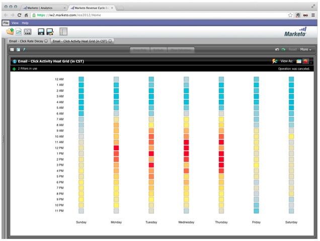

# Versionsinformation: april 2013 {#release-notes-april}

Följande funktioner finns i aprilversionen.

## Integrering av [!DNL Box] {#box-integration}

Anslut Marketo till ditt [!DNL Box]-konto för att enkelt kopiera filer till designstudion.

## Plugin-programmet [!DNL Gmail] {#gmail-plugin}

Om du använder både Marketo [!DNL Sales Insight] och [!DNL Gmail] kan du installera vårt nya [!DNL Gmail]-plugin-program via [!DNL Chrome] store. Med plugin-programmet kan du logga meddelanden med Marketo, läsa in Marketo e-postmallar och skicka meddelanden med Marketo spårningsfunktioner.

## E-postanalys {#email-analysis}

Skapa avancerade e-postrapporter i [!UICONTROL Revenue Explorer], till exempel rapporten Click Activity Heat Grid. Den här rapporten ger insikt i den dag och tid som folk klickar på länkar i dina e-postmeddelanden.

Funktionen för e-postanalys aktiveras i faser under april och maj när vi migrerar dina e-postdata för 2012 och 2013. Med andra ord, vissa kunder kommer att ha tillgång till den här funktionen tidigare än andra.

## Program-API:er {#program-apis}

Stöd för program i SOAP API-anropet, inklusive skrivskyddad åtkomst till programdata som t.ex. antal programmedlemskap, inköpt av, lyckad, inställningar, kanaler, taggar, token och kostnader. Mer information finns i dokumentationen för SOAP API.

## [!DNL ON24] Förbättring {#on-enhancement}

Jobbtitel och företagsnamn synkroniseras till [!DNL ON24] från ditt registreringsformulär för Marketo.
