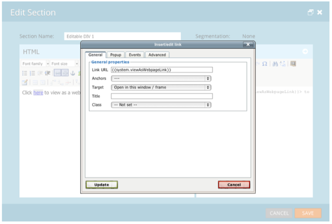

# Versionsinformation: Augusti 2013 {#release-notes-august}

Följande funktioner finns i augusti 2013-versionen.

**Endast e-post med text**

Nu kan du skicka [bara textversionen](/help/marketo/product-docs/email-marketing/general/creating-an-email/create-a-text-only-email.md) av ett e-postmeddelande. Kom ihåg att länkar inte dekoreras när du använder det här alternativet.

## Förbättringar av kundinteraktionsmotorn {#customer-engagement-engine-enhancements}

### Ignorera utfyllt innehåll {#ignore-exhausted-content}

Konfigurera engagemangsprogrammet för att [ignorera överstrålning](/help/marketo/product-docs/email-marketing/drip-nurturing/using-engagement-programs/disable-and-enable-exhausted-content-notifications.md), inklusive inaktivering av meddelanden.

## Engagement Stream Testing {#engagement-stream-testing}

Använd [ny testfunktion](/help/marketo/product-docs/email-marketing/drip-nurturing/engagement-program-streams/test-an-engagement-stream.md) för att simulera en sändning och testa nyligen tillagt innehåll i en liveström.

## Personligt skicka-test {#personalized-send-test}

När du skickar ett e-posttest kan du välja namnet på ett lead för att anpassa testmeddelandet.

## Systemtoken &quot;Visa e-post som webbsida&quot; och &quot;Avsluta prenumeration&quot; {#view-email-as-web-page-and-unsubscribe-system-tokens}

Utnyttja dessa [nya variabler](/help/marketo/product-docs/email-marketing/general/using-tokens/system-tokens-glossary.md) för att få bättre kontroll över deras placering i e-postmeddelanden.

## Automatisk rensning av utlösarkampanj {#automatic-trigger-campaign-cleanup}

Marketo meddelar dig och [automatiskt inaktivera utlösarkampanjer](/help/marketo/product-docs/core-marketo-concepts/smart-campaigns/using-smart-campaigns/automatic-trigger-campaign-cleanup.md) som inte har körts de senaste sex månaderna.

## Förbättring av Marketo Financial Management {#marketo-financial-management-enhancement}

### Uppdatering av programkostnad  {#program-cost-update}

Programkostnadssynkning gör det möjligt att hålla reda på programkostnaderna på flera plattformar.

### Cobalt-användargränssnitt {#cobalt-user-interface}

Vi fortsätter lanseringen av vårt nya Cobalt-gränssnitt. Det här projektet kommer att göra allt i Marketo supergnäll! Uppgraderingen pågår resten av året.
