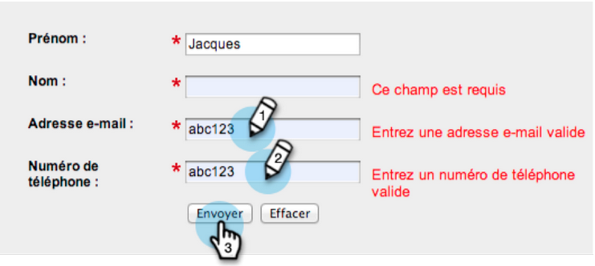
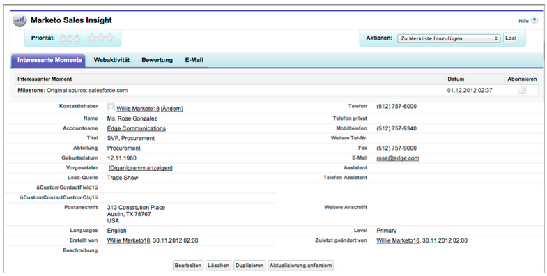

# Versionsinformation: januari 2013 {#release-notes-january}

Januariversionen utökar vårt sociala erbjudande med **Referenserbjudanden**. Dessutom kan [!DNL Marketo Lead Management]-användare ange sina inställningar för tidszon, språk och språkområde. Observera att funktioner som är markerade med en &#42; endast är tillgängliga i Select Edition.

## Referenserbjudanden {#referral-offers}

Ett **hänvisningserbjudande** ger dina leads en anledning att hänvisa sina vänner. Skapa mål och belöningar för lyckade hänvisningar. Du kan använda den på landningssidor, på din webbplats och till och med på Facebook.

## Inställningar för tidszon {#time-zone-preference}

Du kan ändra standardtidszonen för ditt personliga Marketo-konto. Även om standardinställningen för prenumerationen är Pacific Time kan du ändra den till Eastern Time för ditt eget konto.

## Välj ditt [!DNL Marketo Lead Management]-språk {#select-your-marketo-lead-management-language}

Du kan ändra standardspråk för ditt Marketo-användarkonto. Även om standardinställningen för prenumerationen är på engelska kan du ändra den till tyska eller franska för egen användning.

## Felmeddelanden för flerspråkiga formulär {#multi-lingual-form-error-messages}

När en lead fyller i ett Marketo-formulär skapas vissa valideringsmeddelanden automatiskt. Du kan välja ett annat visningsspråk för dessa felmeddelanden. Vi stödjer nu engelska, tyska och franska.

Ett exempel på ett franskt formulär:

## Välj [!DNL Sales Insight]-språk ([!DNL Salesforce] endast) {#select-your-sales-insight-language-salesforce-only}

Om språkinställningen [!DNL Salesforce] är inställd på franska eller tyska kommer Marketo [!DNL Sales Insight] att iaktta den här inställningen. Hämta det senaste MSI-paketet för att få tillgång till den här funktionen (tillgänglig veckan efter 14 januari).

## Fältvisningsnamn {#field-display-name}

Fältvisningsnamn kan visa text på olika språk (t.ex. tecken med flera byte stöds).

## Ändra programdata {#change-program-data}

Flödessteget [!UICONTROL Change Program Data] gör att du kan ändra [!UICONTROL Success]-status och [!UICONTROL Success Date] för en programmedlem manuellt via en kampanj. Du kan använda det här flödessteget för att korrigera ett misstag eller för att manuellt ändra en medlem som inte har deltagit i programmet som det är tänkt.

