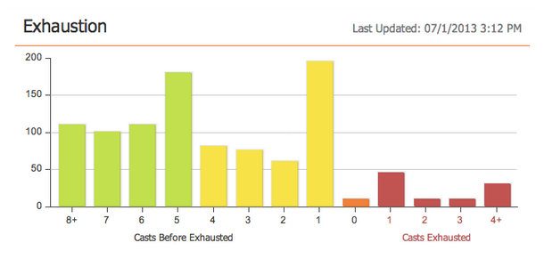

# Versionsinformation: juli 2013 {#release-notes-july}

Följande funktioner finns i juliversionen som är planerad att lanseras på fredag den 26 juli.

## Widgeten Utsträckt innehåll på kontrollpanelen {#exhausted-content-widget-on-the-dashboard}

Anger information om när leads tar bort innehållet i strömmen. Systemet ger dig information om hur många leads som är på väg att nå utmattat innehåll eller hur länge leads har uttömts.

## Kommunikationsbegränsningar {#communication-limits}

Vill du sluta skicka för mycket e-post? Nu är det enkelt att automatiskt begränsa frekvensen till varje enskild person. Ange helt enkelt en gräns för kommunikationen per dag och vecka så sköter systemet resten. Finns i Select, Enterprise och med tilläggspaketet för standardkunder.

## Cobalt-användargränssnitt {#cobalt-user-interface}

Under de närmaste månaderna kommer du att märka att mer av vårt nya tema kommer att lanseras i olika delar av programmet. Inga funktioner flyttas eller tas bort.

## Datumkolumn för programmedlem {#program-member-date-column}

Visa och sortera medlemsrutnätet efter det datum då leadet lades till.

## Ändringar i stavningskontrollen i WYSIWYG Editor {#changes-to-spell-check-in-wysiwyg-editor}

Tjänsten som används av WYSIWYG-redigeraren för stavningskontroll har upphört. Vi har tagit bort stavningskontrollen från redigeraren tills vi hittar en ersättning.
