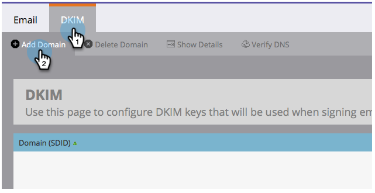

# Versionsinformation: augusti 2014 {#release-notes-august}

Följande funktioner finns i augusti 2014-versionen. Se om det finns funktioner i Marketo Edition. Kom tillbaka efter releasen för länkar till detaljerad funktionsdokumentation.

## Licenser för marknadsföringskalender {#marketing-calendar-licenses}

Efter 5 september 2014 kan bara fem användare ha kostnadsfri tillgång till marknadsföringskalendern. Var noga med att [utfärda/återkalla en licens för en marknadsföringskalender](/help/marketo/product-docs/core-marketo-concepts/marketing-calendar/understanding-the-calendar/issue-revoke-a-marketing-calendar-license.md) till de användare du väljer innan dess, så får du tillgång utan avbrott.

## Nya användarbehörigheter {#new-user-permissions}

Följande nya användarbehörigheter har lagts till:

| Behörighet | Beskrivning |
|---|---|
| Access Revenue Explorer | Om du har köpt RCA har du nu kontroll över vem som har åtkomst till det. |
| Importera lista | Begränsa användare från att importera listor till lead-databasen. |
| Listimport | Begränsa användare från att importera listor via ett program under marknadsföringsaktiviteter. |
| Aktivera utlösarkampanj | Styr vilka som kan och inte kan aktivera utlösarkampanjer. |
| Schemalägg batchkampanj | Styr vilka som kan och inte kan schemalägga batchkampanjer. |

## Exportera användare och roller från [!UICONTROL Admin] {#export-users-and-roles-from-admin}

Du kan nu [exportera en lista över användare och roller](/help/marketo/product-docs/administration/users-and-roles/export-a-list-of-users-and-roles.md) från Marketo. Du kan även inkludera en tidsstämpel för&quot;senaste inloggning&quot; som ska inkluderas i exporten.

## Ta bort kanaler och taggar {#delete-channels-and-tags}

Nu kan du ta bort alla oanvända kanaler och statusar. Som alltid kan du bara dölja en som används.

## Automatiserad [!DNL DKIM] {#automated-dkim}

För förbättrad leverans signeras alla utgående e-postmeddelanden [!DNL DKIM] (DomainKeys Identified Mail). Som standard använder e-postmeddelanden Marketo delade [!DNL DKIM]-signatur. Du kan anpassa den här signaturen.

>[!NOTE]
>
>[!DNL DKIM] kommer att rullas ut långsamt, du kanske inte ser det på några veckor.

## Personalization-uppdateringar i realtid {#real-time-personalization-updates}

Vi har lagt till etiketter på kampanjsidan så att du kan tagga till innehåll i dina hjärtan.

## Mobilanpassning {#mobile-targeting}

Du frågade i communityn och vi levererade! Du kan nu inkludera, exkludera eller ange en specifik call to action för användare på mobiler och surfplattor.

## Förbättrad segmentering och målgruppsanpassning för :1 {#enhanced-segmentation-and-targeting}

Nu kan du använda avancerade filteroperatorer för att rikta in kända besökare.

## Kampanjdelning {#campaign-sharing}

Nu kan ni snabbt och enkelt dela en länk för förhandsgranskning av RTP-kampanjer.

## Rapport om innehållsrekommendationsmotor {#content-recommendation-engine-report}

Vi har lagt till en ny rapport om rekommendationsverktyget för innehåll så att du kan se en bra sammanfattning.

## Förbättrad användaradministration {#enhanced-user-administration}

Administratörsanvändare kan nu låsa användare på grund av flera misslyckade inloggningsförsök. Du kan även låsa upp dessa användare om du vill.

## Spårningskontroll {#tracking-control}

Nu kan du utesluta specifika IP-adresser från all spårning och rapportering i realtidsversionen av Personalization.

