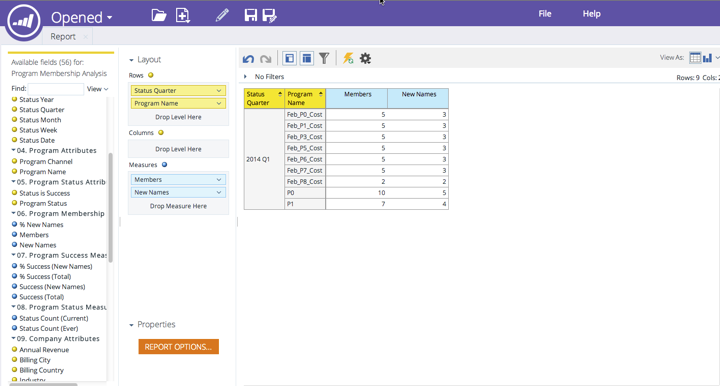

# Versionsinformation: december 2014 {#release-notes-december}

Följande funktioner ingår i december 2014-versionen. Kontrollera om det finns funktioner i Marketo Edition. Efter releasen måste du komma tillbaka för att hitta länkar till detaljerade artiklar för varje funktion!

## [!DNL Sales Insight] rapporter {#sales-insight-reports}

Med [[!DNL Sales Insight] E-postresultatrapporten](/help/marketo/product-docs/marketo-sales-insight/msi-for-salesforce/features/performance-reports/sales-insight-email-performance-report.md) kan du visa e-postmått per e-post och säljare. Det har stöd för e-postmeddelanden som skickas via [!DNL Salesforce], [!DNL Microsoft Dynamics], plugin-programmet [!DNL Outlook] och plugin-programmet [!DNL Gmail].

## [!DNL Facebook] anpassade målgrupper {#facebook-custom-audiences}

När din Marketo-administratör har lagt till [[!DNL Facebook] via [!UICONTROL Admin] > [!UICONTROL LaunchPoint]](/help/marketo/product-docs/demand-generation/ad-network-integrations/add-facebook-custom-audiences-as-a-launchpoint-service.md) kan du enkelt skapa, uppdatera eller [ersätta en  [!DNL Facebook] anpassad målgrupp med leads från en statisk eller smart lista från Marketo](/help/marketo/product-docs/demand-generation/facebook/create-a-custom-audience-in-facebook.md). Leta efter den nya ikonen [!DNL Facebook] längst ned i huvudstödrastret i en statisk eller smart lista.

## Förbättrad kloning över flera arbetsytor  {#improved-cloning-across-workspaces}

[Det har aldrig varit enklare att klona ett program](/help/marketo/product-docs/core-marketo-concepts/programs/working-with-programs/clone-a-program.md) till en annan arbetsyta! När du klickar på klona väljer du målarbetsytan. Nu behöver du inte längre klona till en mapp och sedan flytta mappen!

>[!NOTE]
>
>Den här nya klonfunktionen är för närvarande bara tillgänglig för program.

## Referera till smart lista {#reference-smart-list}

[Smarta listor som delas med en annan arbetsyta kan refereras till](/help/marketo/product-docs/core-marketo-concepts/smart-lists-and-static-lists/using-smart-lists/reference-a-list-or-smart-list-across-workspaces.md) när du skapar en smart lista eller ett smart flöde.

## Förbättringar av listimport {#list-import-improvements}

[Importera filer](/help/marketo/getting-started/quick-wins/import-a-list-of-people.md) som är kodade med UTF-16, Shift-JIS eller EUC-JP. Vi har fortsatt stöd för UTF-8-kodade filer.

## Länkspårning i e-postskript {#link-tracking-in-email-scripting}

Länkar i e-postskript kommer nu att spåras och vara tillgängliga i rapporten E-postlänkens prestanda.

## Inställning för tokenkodning {#token-encoding-setting}

Vi har introducerat en ny säkerhetsfunktion för automatisk kodning av HTML-tokens, som kommer att aktiveras som standard i mars 2015. Fram till dess kan du växla den här funktionen i Fälthantering för att testa beteendet i förväg. Alla lead- och företagstokens kodas när de infogas i e-postmeddelanden eller på landningssidor. Det finns även alternativ för enskilda fält.

## Nya REST API-anrop {#new-rest-api-calls}

Tre nya anrop till lead- och aktivitetsREST API:

・ Hämta leadpartitioner

・ Associera lead

・ Lägg samman lead

Fullständig information finns tillgänglig efter lanseringen på [https://experienceleague.adobe.com/sv/docs/marketo-developer/marketo/home](https://experienceleague.adobe.com/sv/docs/marketo-developer/marketo/home)

## [!DNL Munchkin Javascript] Kompatibilitetsförbättringar {#munchkin-javascript-compatibility-enhancements}

Vi har gjort flera smärre förbättringar av [!DNL Munchkin] för att säkerställa att den fortsätter att läsas in snabbt och fungera som du vill i fall med andra JavaScript på sidan.

Utbyggnaden kommer att stagnera i mitten av december och fortsätta under de kommande månaderna.

## [!UICONTROL Revenue Explorer] Uppgraderat utseende och känsla {#revenue-explorer-upgraded-look-and-feel}

## RTP: Modulen Namngiven kontolista {#rtp-named-account-list-module}

Hantera och övervaka dina nyckelkonton med hög kapacitet på den nya [!UICONTROL Named Accounts]-sidan. Ladda upp nya listor med namngivna konton för att identifiera och inrikta dig på dessa organisationer. Vi har automatiserat processen så att ni får större kontroll och flexibilitet att implementera era kontobaserade marknadsföringsplaner och inrikta er på nyckelkonton i olika kanaler (webb och annonsering).

## RTP: Glidande effekt för In Zone-kampanjer {#rtp-sliding-effect-for-in-zone-campaigns}

Vi har lagt till en ny Sliding-effekt för InZone-kampanjer som gör att ditt personaliserade innehåll kan glida in på plats när sidan läses in.

