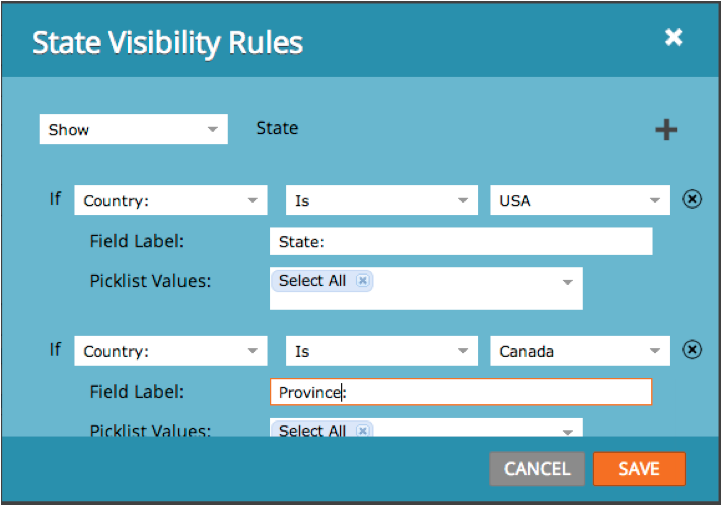

# Versionsinformation: januari 2014 {#release-notes-january}

Följande funktioner ingår i januari 2014-versionen. Kontrollera om din [Marketo Edition](https://www.marketo.com/pricing/) innehåller funktioner som är tillgängliga.

## Forms 2.0 {#forms}

Kommentar: Dokumentation för Forms 2.0 kommer snart!

Ta kontroll över hur blanketterna skapas och ge webbutvecklarna en chans. Forms 2.0 är utformat för att ge marknadsförare möjlighet att skapa både visuellt och funktionellt robusta formulär utan att behöva ha programmeringskunskaper.

**Ge din Forms den visuella makeover de förtjänar:**

Temamodesigner, knappanpassning och flexibla layouter gör att du kan skapa moderna formulär som passar in i webbplatsens utseende och känsla.

**Logik för villkorlig synlighet och uppföljningssida:**

Vill du att &quot;State&quot; bara ska visas om en användare väljer USA som &quot;Country&quot;? Vad sägs om att presentera olika rapporter för kunderna baserat på hur de besvarar frågor i formuläret? Bygg in villkorlig logik i formulären direkt från redigeraren. Inget javascript krävs!

**Bädda enkelt in Forms på dina egna landningssidor:**

Nu är det dags att lyfta HTML-kod från formulär som placerats på Marketo landningssidor och släppa dem i en iFrame. Hämta bara inbäddningskoden och placera den på landningssidan där du vill att formuläret ska återges. Två lägen - normal och ljuslåda - ger dig ännu större flexibilitet med Marketo-formulär på din webbplats.

## Kommunikationsbegränsningar för e-postprogram {#communication-limits-for-email-program}

[Ange kommunikationsgränser för ett e-postprogram](/help/marketo/product-docs/email-marketing/email-programs/email-program-actions/enable-disable-communication-limits-in-an-email-program.md) för att vara säker på att du inte överkommunicerar med databasen. Om en person överskrider gränsen får hon inte något e-postmeddelande.

## Ytterligare fält i analys av programmedlemskap {#additional-fields-in-program-membership-analysis}

Nu kan du lägga till och gruppera [mätvärden för programmedlemskapsanalys](/help/marketo/product-docs/reporting/revenue-cycle-analytics/program-analytics/build-a-program-membership-analysis-report-that-lists-leads.md) efter lead- och företagsattribut. Du kan till exempel lägga till fältet Bransch för att se hur programmedlemmarna och framgångarna har delats upp.

