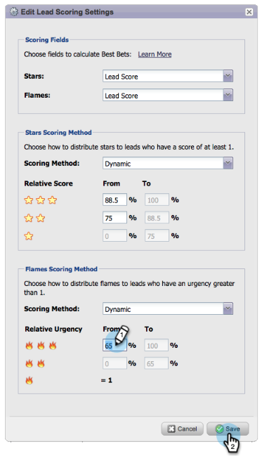

# Versionsinformation: Juni 2014 {#release-notes-june}

Följande funktioner ingår i versionen från juni 2014. Kontrollera om det finns funktioner i Marketo Edition.

## Uppdaterat användargränssnitt - kommer snart! {#updated-ui-coming-soon}

En ny look och känsla, inklusive navigering för Marketo Lead Management, kommer snart i en senare version!

## Sales Insight plugin for Outlook 2013 {#sales-insight-plugin-for-outlook}

Detta kräver att du hämtar det nya plugin-programmet. Du kan hämta den från [här](/help/marketo/product-docs/marketo-sales-insight/msi-outlook-plugin/install-the-marketo-email-add-in-for-outlook-with-a-registration-code.md).

## Tokenupplösning {#token-resolution}

När du skickar ett test-e-postmeddelande från Sales Insight går det inte att matcha de variabler som finns i e-postmeddelandet och standardvärdet skickas. Den här förbättringen säkerställer att tokens löses i testmeddelanden.

## Anpassa procenttal för stjärnor och flamma {#customize-percentages-for-stars-and-flames}

[Ange procentandelen](/help/marketo/product-docs/marketo-sales-insight/msi-for-salesforce/features/stars-and-flames/customize-stars-and-flames.md) av leads som får 1, 2 eller 3 stjärnor och lågor.

## Lead ReST API {#lead-rest-api}

Skapa, läs och uppdatera leads programmatiskt via vårt nya ReST-API. För att komma igång med ReST måste du [skapa en anpassad tjänst](/help/marketo/product-docs/administration/additional-integrations/create-a-custom-service-for-use-with-rest-api.md) i Marketo. Gå sedan till [utvecklarwebbplats](https://developers.marketo.com/documentation/rest/) om du vill ha mer information om hur du använder detta API.

## Marketo Real-Time Personalization (RTP) Campaigns - uppdatering {#marketo-real-time-personalization-rtp-campaigns-page-update}

RTP-kampanjer innehåller nu en ny design med miniatyrbilder och kampanjresultat. Dessutom kan du [ordna era kampanjer](/help/marketo/product-docs/web-personalization/working-with-web-campaigns/sort-web-campaigns-by-latest-or-top-performing.md) efter datum eller bästa prestanda.

## Integrering med Web Analytics {#web-analytics-integrations}

Lägg till alla era RTP-data på webbanalysplattformen.

Integrationen med [Google Analytics](/help/marketo/product-docs/web-personalization/reporting-for-web-personalization/web-analytics-integrations/integrate-rtp-with-google-analytics.md) (GA) är nu aktiverat som standard, så under Kontoinställningar aktiverar du den switch som du vill skicka data till anpassade GA-variabler och GA-händelser för.

Vi har också slutfört integreringen med [Adobe SiteCatalyst](/help/marketo/product-docs/web-personalization/reporting-for-web-personalization/web-analytics-integrations/integrate-with-adobe-analytics.md).
