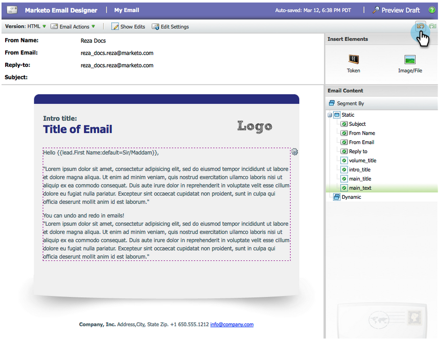
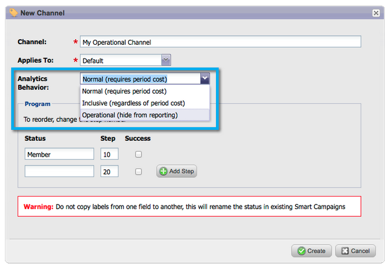

# Versionsinformation: Mars 2014 {#release-notes-march}

Följande funktioner ingår i mars 2014-utgåvan. Kontrollera om det finns funktioner i Marketo Edition. Efter releasen måste du komma tillbaka och söka efter länkar till kunskapsbasartiklar för varje funktion.

## Uppdateringsknapp för instrumentpanelen för e-postprogram {#email-program-dashboard-refresh-button}

Använd [uppdateringsknapp](/help/marketo/product-docs/email-marketing/email-programs/email-program-data/use-the-email-program-dashboard.md) för att få aktuell e-poststatistik om din e-postutsändning eller ditt AB-test!

## Ångra/Gör om i e-postredigeraren och kodredigeraren {#undo-redo-in-the-email-editor-and-snippet-editor}

[Ångra eller göra om](/help/marketo/product-docs/email-marketing/general/email-editor-2/edit-elements-in-an-email.md) upp till 50 åtgärder för den aktuella sessionen.

## Programstatuskolumner i programresultatrapport {#program-status-columns-in-program-performance-report}

När du använder [rapport om programprestanda](/help/marketo/product-docs/core-marketo-concepts/programs/program-performance-report/add-program-status-columns-to-a-program-report.md)kan du nu se hur många som har programstatus.

## Inkluderande och operativa program för analys {#inclusive-and-operational-programs-for-analytics}

Nu kan du [inkludera program utan periodkostnader](/help/marketo/product-docs/reporting/revenue-cycle-analytics/program-analytics/make-a-program-without-a-period-cost-available-in-revenue-explorer-and-analyzers.md) i Intresseutforskaren och Analysprogram genom att ange alternativet Analytics Behavior till Inclusive (Inkluderande) när du redigerar programkanaler. Du kan också utesluta verksamhetsprogram från att rapportera alla tillsammans genom att välja &quot;Operativ&quot;.

## Hybrid- och implicita alternativ för Leadkonvertering {#hybrid-and-implicit-options-for-lead-conversion}

Ni kan ändra hur Marketo kontaktar och möjligheterna till konverteringsstatistik för leads i Lead Analysis. Du kan [ändra attribueringsinställningen](/help/marketo/product-docs/administration/settings/change-attribution-settings-for-analytics.md) till något av tre alternativ. Om du ändrar den här inställningen ändras inga Marketo- eller CRM-data. det ändrar helt enkelt hur dina rapporter fungerar och kan återställas när som helst.

Inställningen Explicit behandlar endast kontakter med roller i en affärsmöjlighet som konverterade leads (standardbeteende). Implicit behandlar alla kontakter som är kopplade till kontot i affärsmöjligheten, oavsett roll, som konverterade. Hybrid kommer att behandla kontakter med roller som konverterade om sådana finns. om inget, behandlas alla kontakter i kontot som konverterade.

Som en påminnelse ändrar den här inställningen även programmeringsstatistik.

## Ytterligare användarspråk {#additional-user-language}

Välj [Marketo Application Language](/help/marketo/product-docs/administration/settings/select-your-language-locale-and-time-zone.md). Visa Marketo Lead Management-gränssnittet på det språk du föredrar - nu med stöd för japanska.

## Marketo Developer Blog {#marketo-developer-blog}

The [Marketo Developer blogg](https://developers.marketo.com/blog/) riktar sig till webbutvecklare och programvaruingenjörer som stöder den moderna marknadsförarens snabbt föränderliga behov. Du kan prenumerera på meddelanden om nya integreringsalternativ, API-versionsuppdateringar och en ny serie instruktionsartiklar som innehåller kodexempel och metodtips om integrationen med Marketo-plattformen.

The [första artikeln](https://developers.marketo.com/blog/retrieving-customer-and-prospect-information-from-marketo-using-the-api/) i den här serien visar hur du effektivt hämtar information om de personer (kunder/kontakter/leads) som lagras i Marketo med API:t.
