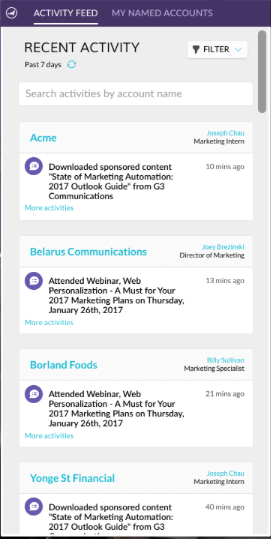

# Versionsinformation: Förbättringar av ABM 17 augusti {#release-notes-august-abm-enhancements}

Följande funktioner finns i den förbättrade versionen från augusti 2017. Se om det finns funktioner i din Marketo-utgåva.

Klicka på titellänkarna för att visa detaljerade artiklar för varje funktion.

## Kontoinsikt {#account-insight}

**[Account](/help/marketo/product-docs/target-account-management/setup-tam/account-insight-plug-in-overview.md)** Insightis är en Google Chrome-plugin som ger er åtgärdbara ABM-resurser och kontoinsikter till era säljteam, vilket gör att de kan arbeta nära med marknadsföring för att engagera sina konton effektivt. Säljarna får insyn i de data och insikter som genereras för vart och ett av de namngivna konton de äger. Detta inkluderar profilpoäng, en prioriterad lista över deras namngivna konton, engagerade personer i dessa konton och en liveaktivitetsström över nyligen genomförda aktiviteter från kontot.

 

## [Dynamiska kontolistor](/help/marketo/product-docs/target-account-management/target/account-lists.md) {#dynamic-account-lists}

Vi lägger till ett nytt sätt att skapa kontolistor i ABM. Förutom befintliga kontolistor kan du nu skapa dynamiska kontolistor som genereras från offentliga CRM-kontovyer. En CRM-kontovy är en uppsättning regler som fungerar som ett filter när konton visas. Du kan till exempel använda den för att hitta konton där Bransch är hälso- och sjukvård _och_ Intäkterna är över 100 miljoner USD.

