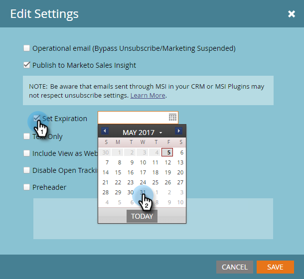
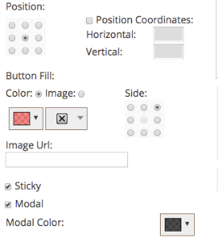

# Versionsinformation: våren 17 {#release-notes-spring}

Följande funktioner finns i vårutgåvan 17. Se om det finns funktioner i Marketo Edition.

Klicka på titellänkarna för att visa detaljerade artiklar för varje funktion. **Obs!** Om ett ämne har flera underrubriker placeras länkarna där.

## [LinkedIn Lead Gen Forms](/help/marketo/product-docs/demand-generation/social/social-functions/set-up-linkedin-lead-gen-forms.md) {#linkedin-lead-gen-forms}

[[!UICONTROL LinkedIn Lead Gen] Forms](https://business.linkedin.com/marketing-solutions/native-advertising/lead-gen-ads) är ett mer direkt sätt för ett företag att köra lead-genereringskampanjer på [!DNL LinkedIn]. Man kan fylla i blanketter för att uttrycka sitt intresse för en produkt eller tjänst, vilket gör det möjligt för företaget att samla in personuppgifterna och synka dem till Marketo, där automatiserade uppföljningsprocesser och leadhanteringsaktiviteter kan förekomma.

Marketo-integrationen med [!UICONTROL LinkedIn Lead Gen] Forms hämtar automatiskt information som ett lead tillhandahåller i formuläret Lead Gen. Uppföljningsåtgärder och meddelanden kan sedan automatiseras med den nya utlösaren **Fyll i [!DNL LinkedIn Lead Gen] formulär** och filtrera.

## [Förfaller MSI-mall](/help/marketo/product-docs/marketo-sales-insight/msi-for-salesforce/features/actions-in-the-msi-panel/send-marketo-email/publish-an-email-to-sales-insight.md) {#expire-msi-template}

Nu är det dags att rensa gamla mallar i [!DNL Sales Insight]. Ange ett förfallodatum när du publicerar ditt e-postmeddelande så tar vi hand om att avpublicera det åt dig när utgångsdatumet ändras.

>[!NOTE]
>
>Att ange förfallodatumet för 5/31/17 innebär att mallen tas bort från [!DNL Sales Insight] vid dagens slut den 17 maj 2017.

## [Massextrahera API:er för personer och aktiviteter](https://developers.marketo.com/rest-api/bulk-extract/) {#bulk-extract-apis-for-people-and-activities}

Överför enkelt stora mängder person- och aktivitetsdata från Marketo till era externa system.

## ABM-förbättringar {#abm-enhancements}

**[Anpassade fält på namngivna ABM-konton](https://docs.marketo.com/x/1wnG)**

Med Marketo ABM kan du nu skapa upp till 10 anpassade fält på dina namngivna konton. Du kan mappa dessa anpassade fält till fält i CRM-kontoobjektet, så synkroniserar Marketo ABM data så att du kan utöka dina namngivna ABM-konton och hjälpa till att driva marknadsföringen framåt.

**[Percentiell poängsättning på namngivna ABM-konton](https://docs.marketo.com/display/docs/assets/abmpercentiles.png)**

Poängen för namngivna konton kan variera mycket. Marketo ABM beräknar nu automatiskt en percentil för var och en av poängen så att du snabbt kan se var varje namngivet konto finns bland dina andra namngivna konton.

**[API:er för ABM-kontolista](https://developers.marketo.com/rest-api/lead-database/named-account-lists/)**

Utnyttja de omfattande och robusta integreringarna med ABM-partners med förbättrat API-stöd för namngivna kontolistor.

## Förbättringar i Personalization {#web-personalization-enhancements}

**[Webbkampanj vid rullning](/help/marketo/product-docs/web-personalization/working-with-web-campaigns/set-how-your-web-campaign-displays.md)**

Nya Web Campaign-effekter ger webbbesökarna en mer personaliserad upplevelse. Ställ in din personliga [!UICONTROL Web Campaigns] så att den bara visas när en webbbesökare rullar ned på din webbsida. Du kan ange att dialogrutan [!UICONTROL Web Campaigns] ska visas vid rullning baserat på:

* procent av sidan som rullas
* pixeln har nåtts
* bläddra nedanför sidans vikning

**[Webbkampanj vid avslutningsmetod](/help/marketo/product-docs/web-personalization/working-with-web-campaigns/set-how-your-web-campaign-displays.md)**

Fånga besökarens uppmärksamhet innan de stänger sidan. Ange att din personliga [!UICONTROL Web Campaigns] endast ska visas när en musgest indikerar att besökaren lämnar sidan.

**[Animeringseffekter för[!UICONTROL Web Campaigns]](/help/marketo/product-docs/web-personalization/working-with-web-campaigns/create-a-new-dialog-web-campaign.md)**

Ställ in animeringseffekterna för Dialog Web Campaign för att anpassa hur en kampanj visas när du öppnar eller avslutar webbsidan. Du kan välja mellan sex olika effekter och styra timing och riktning för dialogrutan.

**[Dialogrutan Stäng knappanpassning](/help/marketo/product-docs/web-personalization/working-with-web-campaigns/create-a-new-dialog-web-campaign.md)**

Anpassa stängningsknappen för dialogrutor. Välj bland en rad alternativ som används i det genomskinliga dialogformatet [!UICONTROL Web Campaigns]. Markera ikonen, färgen och placeringen för knappen Stäng. Du kan också lägga till en egen knappbild.

**[Arkivera webbkampanjer](/help/marketo/product-docs/web-personalization/working-with-web-campaigns/archive-a-web-campaign.md)**

Arkiv är en ny webbkampanjstatus som gör att du kan arkivera [!UICONTROL Web Campaigns] och dölja dem från standardvyn för webbkampanjer. På så sätt kan ni fokusera på era mest relevanta, aktiva kampanjer och hämta äldre arkiverade kampanjer på begäran.

**[Lokalisering](/help/marketo/product-docs/administration/settings/select-your-language-locale-and-time-zone.md)**

Web Personalization finns nu på alla språk som stöds av Marketo (engelska, japanska, tyska, spanska, franska och portugisiska).

## Prediktiva förbättringar {#predictive-enhancements}

**[Lokalisering](/help/marketo/product-docs/administration/settings/select-your-language-locale-and-time-zone.md)**

Prediktivt innehåll finns nu på alla språk som stöds av Marketo (engelska, japanska, tyska, spanska, franska och portugisiska).

## [Äldre RTF-redigerare och formulärredigerare 1.0-borttagning](https://nation.marketo.com/docs/DOC-4315) {#legacy-rich-text-editor-and-form-editor-deprecation}

Från och med den 1 augusti 2017 kommer kunder som fortfarande använder den gamla RTF-redigeraren och formulärredigeraren 1.0 automatiskt att övergå till den nya versionen.
