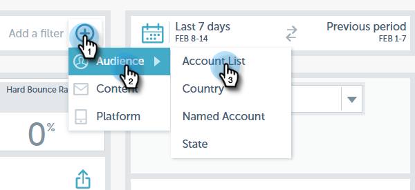

# Versionsinformation: Vinter 17 {#release-notes-winter}

Följande funktioner finns i vinterversionen 17. Se om det finns funktioner i Marketo Edition.

Klicka på titellänkarna för att visa detaljerade artiklar för varje funktion.

>[!NOTE]
>
>Om ett ämne har flera underrubriker placeras länkarna där.

## [Avancerad matchning för anpassade målgrupper på Facebook](/help/marketo/product-docs/demand-generation/ad-network-integrations/add-facebook-custom-audiences-as-a-launchpoint-service.md) {#advanced-matching-for-facebook-custom-audiences}

Grundläggande matchning använder endast e-postadresser, men i ny avancerad matchning används ytterligare sju fält, vilket ökar matchningsfrekvensen för ytterligare konvertering.

## [API för anpassad objektimport](https://developers.marketo.com/rest-api/lead-database/custom-objects/) {#custom-object-import-api}

Detta API ger ett snabbare gränssnitt för att synkronisera anpassade objekt till Marketo. Du kan importera CSV-, TSV- eller SSV-kalkylbladsfiler till Marketo som anpassade objekt.

## [Export av Personalization-webbkampanjer](/help/marketo/product-docs/web-personalization/working-with-web-campaigns/export-web-campaign-data.md) {#web-personalization-campaigns-export}

Exportera all information och alla analyser i webbkampanjen i ett CSV-format. Sedan kan du visa dina data i en bekväm layout.

## Lokalisering {#localization}

Apparna Web Personalization, [!UICONTROL Predictive Content] och Email Insights finns nu på japanska, tyska och spanska. Du [väljer språk och språkområde](/help/marketo/product-docs/administration/settings/select-your-language-locale-and-time-zone.md) för att visa ditt innehåll på dessa språk.

## Kontobaserade marknadsföringsförbättringar {#account-based-marketing-enhancements}

**[Importera namngivna konton](/help/marketo/product-docs/target-account-management/target/named-accounts/import-named-accounts.md)**

Med importalternativet [!UICONTROL Named Account] kan du skapa eller uppdatera flera poster samtidigt via CSV-överföring.

**[Stöd för e-postinsikter](/help/marketo/product-docs/reporting/email-insights/filtering-in-email-insights.md)**

Använd [!UICONTROL Named Account] eller [!UICONTROL Account List] som dimensioner i e-postinsikter.

## [!UICONTROL Predictive Content] förbättringar {#predictive-content-enhancements}

**[Filtrera efter[!UICONTROL Enabled Source]](/help/marketo/product-docs/predictive-content/working-with-predictive-content/understanding-predictive-content.md)**

Filtrera [!UICONTROL Predictive Content] bitar som är aktiverade för [!UICONTROL Email], [!UICONTROL Rich Media] eller [!UICONTROL Recommendation Bar].

**[Filter[!UICONTROL Analytics by Source]](/help/marketo/product-docs/predictive-content/working-with-predictive-content/understanding-predictive-content.md)**

Filtrera [!UICONTROL Predictive Content]-analyser för specifika källor - [!UICONTROL Email], [!UICONTROL Rich Media] eller [!UICONTROL Recommendation Bar].

**[!UICONTROL Predictive Content]Editor**

Det finns en förbättrad redigeringsupplevelse och layout som delar innehållsförberedelser efter källa: [!UICONTROL Email], [!UICONTROL Rich Media] eller [!UICONTROL Recommendation Bar].

**[Automatisk identifiering av innehåll för prediktiv](/help/marketo/product-docs/predictive-content/getting-started/enable-content-discovery.md)**

Bild-URL och metadata används nu i processen för automatisk identifiering av innehåll.

## [SDK-förbättringar](https://developers.marketo.com/mobile/) {#sdk-enhancements}

Utvecklare har nu ytterligare kontroll över leveransen av push-meddelanden med ett nytt SDK API-anrop som gör att utvecklare kan ta bort push-tokens.

## Vibes SMS LaunchPoint Integration

Förbättra er målinriktning med ett nytt filteralternativ,&quot;Member of Vibes List&quot;.

## [Äldre RTF-redigerare och formulärredigerare 1.0-borttagning](https://nation.marketo.com/docs/DOC-4315) {#legacy-rich-text-editor-and-form-editor-deprecation}

Från och med den 1 augusti 2017 kommer kunder som fortfarande använder den gamla RTF-redigeraren och formulärredigeraren 1.0 automatiskt att övergå till den nya versionen.

## [Marketo Activity API:er](https://developers.marketo.com/blog/important-change-activity-records-marketo-apis/) {#marketo-activity-apis}

En viktig förändring kommer att göras i Marketo aktivitets-API:er. Är du förberedd?
